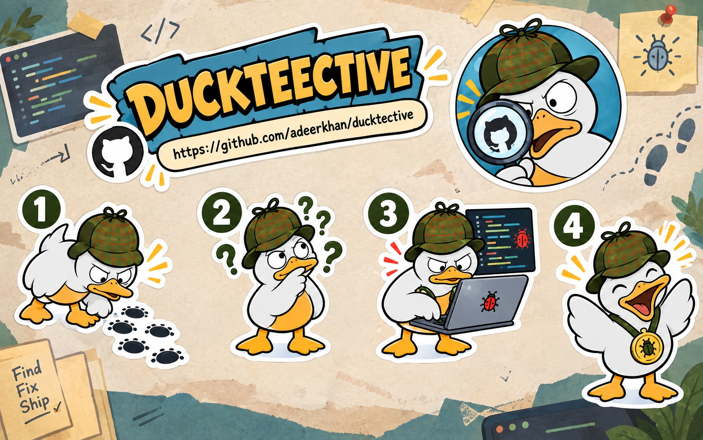
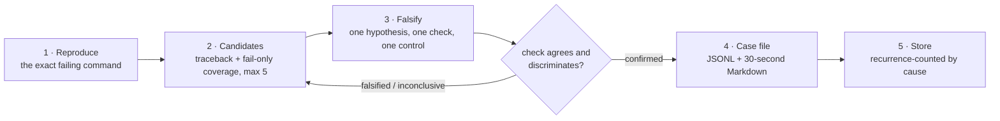

<div align="center">
  

  <h1>Ducktective</h1>

  <p><strong>No claim without a check.</strong><br>
  An <a href="https://agentskills.io/">Agent Skill</a> that stops a coding agent from filing a
  confident, plausible, <em>wrong</em> root cause.</p>

  <p>
    <a href="LICENSE"></a>
    <a href="CHANGELOG.md"></a>
    <a href="https://agentskills.io/"></a>
    
    <a href=".github/workflows/eval.yml"></a>
  </p>

  <p>
    <a href="#what-it-is">What it is</a> ·
    <a href="#how-it-works">How it works</a> ·
    <a href="#install">Install</a> ·
    <a href="#the-tools">Tools</a> ·
    <a href="docs/guide.md">Guide</a> ·
    <a href="docs/implementation.md">Plan</a>
  </p>
</div>

---

## What it is

You hand it a failing command. It runs that command **before it thinks**. Each suspect is
stated as a hypothesis and tested with the smallest check that could disprove it. The
verdict is arithmetic over what a process actually returned — never a model grading its own
work — and the result is a case file a human reads in thirty seconds.

It is a contract the host agent is walked through, not a runtime. It does not index your
repo, run a server, need an API key, or take a dependency beyond Node's standard library.

```
Ducktective, investigate this failing test.
```

> **Honest status — 2026-09-20 (v0.2.0).** It has confirmed real bugs in code it did not
> write, on the first candidate, surviving a re-run. That is a demonstration, not a rate.
> **The discovery claim is not a selling point:** traceback order and fail-only coverage
> reorder information the host already had. What is verified here is the _instrument_: a
> verdict cannot be filed unless a check that ran agrees with a prediction **and** the check
> demonstrably depends on the line being accused. The next work is the comparative benchmark
> — a bare agent versus this — because no number yet shows the loop beats a plain "fix this"
> prompt. That plan is in [`docs/implementation.md`](docs/implementation.md).

---

## How it works

The loop has five steps. Only step 3 is allowed to produce a verdict, and it is arithmetic.



1. **Reproduce** — the hard gate. Run the exact command; capture exit code, output,
   traceback, and coverage if the repo produces it. No in-repo evidence means `error`;
   symptom absent means `does_not_reproduce` and **stop**.
2. **Candidates** — deliberately cheap: traceback frames nearest the fault, plus lines the
   failing run covered and a passing run did not. Capped at five. No graph.
3. **Falsify** — one candidate at a time: a one-line hypothesis, the smallest executable
   check, a control that must pass, and a **mutation probe** that neuters the accused line
   on a scratch worktree and re-runs. A check whose outcome does not move never touched that
   line, and the verdict says so (`inconclusive_vacuous`) instead of confirming.
4. **Case file** — the product. A JSON line plus a Markdown mirror, written by a tool that
   **refuses unearned verdicts**: a verdict with no executed check, a check that contradicts
   its own exit code, or a patch before a confirmed cause.
5. **Store** — per repo, append-mostly, one line per case id, and now deduplicated by
   **cause identity**: a repeated root cause becomes a recurrence count, not a near-duplicate.

Read [`docs/guide.md`](docs/guide.md) for a full worked walkthrough, and
[`docs/architecture.md`](docs/architecture.md) for the implementation and its limits.

---

## Install

From a clone — two commands, no dependencies:

```bash
git clone https://github.com/adeerkhan/ducktective && cd ducktective
node skills/ducktective/bin/install.mjs --target claude
```

| Target            | Installs to                                                                |
| ----------------- | -------------------------------------------------------------------------- |
| `--target claude` | `~/.claude/skills/ducktective`                                             |
| `--dest <dir>`    | anywhere else — Cursor, Copilot, Gemini CLI, anything reading a `SKILL.md` |

`claude` is the only named target: it is the one scan path checked against documentation and
used on a real machine. Everything else takes `--dest`. The installer copies `SKILL.md`, the
case-file schema, and `scripts/` — never the tests or itself. It **refuses to overwrite a
skill file you have edited** (`--force` to mean it), `--dry-run` prints the plan, and
re-running an unchanged install writes nothing.

**Requirements:** Node 20.19+ (declared as `engines`). The corpus needs Python for its cases;
the gate itself drives any test runner, because `--cmd` is just a shell command.

---

## The tools

Four scripts, zero dependencies, plain `node`. Any agent that can run a shell command can use
them directly. `check.mjs` composes them into one command that grades a claim.

| Tool             | What it does                                                                                                                                                               | Exit codes                                                         |
| ---------------- | -------------------------------------------------------------------------------------------------------------------------------------------------------------------------- | ------------------------------------------------------------------ |
| `reproduce.mjs`  | The gate. Runs the command, parses the traceback, seeds candidates.                                                                                                        | `0` reproduced · `1` does not reproduce (**stop**) · `2` never ran |
| `bisect.mjs`     | Walks history by binary search (O(log n) runs) for the first bad commit, its hunks, and whether your claim sits inside them. Prices the walk and refuses above `--budget`. | `0` found · `1` refused · `2` inconclusive · `3` dry run           |
| `run_check.mjs`  | Executes the oracle and decides `confirmed`/`falsified` from `--predict` against the exit code. `--control`, `--probe`, `--verify`, `--depth`, `--escalate`.               | `0` recorded · `1` refused · `2` not evaluable · `3` dry run       |
| `write_case.mjs` | The store and the enforcement point. Refuses unearned verdicts; indexes causes for recurrence. `--causes` prints the index.                                                | `0` stored · `1` refused · `2` bad input                           |
| `check.mjs`      | One command that composes the four and prints an evidence box plus a letter grade.                                                                                         | `0` report produced (including negative grades) · `3` dry run      |

### What `write_case.mjs` refuses

The discipline has to survive the model that runs it, so these are type errors rather than
advice:

- a `confirmed` or `falsified` verdict with no captured output, or with no recorded exit code
  — that is, **a verdict typed by hand**
- a verdict that contradicts its own check (`predicted pass, exit 1 ⇒ falsified`)
- `confirmed` with no discrimination receipt — no passing control and no flipped probe
- a pass prediction confirmed without a flipped probe (a passing control cannot rule out an
  always-pass check)
- candidates on a case that did not reproduce
- `high`/`medium` confidence, a `confirmed_cause`, or a patch suggestion before the status is
  `confirmed` and the derived cause-confidence clears the floor
- a case id that would escape the store directory, and any field the schema does not have

---

## The receipt ladder (roadmap)

Today a verdict proves the check is _sensitive_ to a line. The refinement in
[`docs/implementation.md`](docs/implementation.md) promotes a claim through independent,
mechanical rungs — prediction → control → line-neuter → independent replication → a
**reversible repair probe** (repair it and the repro passes; re-break it and the repro fails)
— each recorded with a derived cause-confidence, and only then reportable. Everything beyond
the first three rungs is a proposal until the benchmark says the loop pays.

---

## A case file

`write_case.mjs` writes `.ducktective/cases.jsonl` (one line per case, updated in place),
`.ducktective/causes.jsonl` (one line per distinct root cause), and
`.ducktective/cases/<id>.md` for humans. This is real output from the tools against a
self-authored fixture, trimmed for width:

```markdown
# DT-260914-6dc0aa — totals drop the last row

**Status:** `confirmed` · **Confidence:** high · **Cause confidence:** 0.5 · **Opened:** 2026-09-14T15:35:49Z
**Reproduction:** `python -m unittest -q test_totals` → `reproduced` in 106 ms (exit 1)

### 1. `app.py:7 total()` — confirmed

_Hypothesis:_ end defaults to len(rows)-1, so rows[end + 1] is always one past the last index
_Evidence:_ check: exit 1 · IndexError: list index out of range · control: exit 0

**Confirmed cause:** app.py:7 — with end defaulting to len(rows)-1, rows[end+1] is always one
past the last index
```

The JSONL is machine-readable on purpose: another skill can read the same file, and `cat` or
`grep` is the reader. There is no website to open it in.

---

## How it is checked

| Layer              | Command                          | What it can prove                                                                                                                                                |
| ------------------ | -------------------------------- | ---------------------------------------------------------------------------------------------------------------------------------------------------------------- |
| Guards             | `npm test`                       | prose cannot drift from code: one `SKILL.md`, every shipped tool documented, the architecture reference tracked, no shipped file naming a retired tool           |
| Unit + integration | `npm test`                       | frame order, the verdict policy and its schema parity, id containment, policy refusals, tree-kill, bounded capture, installer behaviour, cause recurrence        |
| Behaviour corpus   | `npm run eval`                   | the tools do what the docs say against real pytest/unittest/`node:test`/`coverage.py` runs — **self-authored cases**, so a regression net, not evidence of value |
| Mutation canary    | `npm run canary`                 | candidate ranking did not regress since last night — **mutants are easier than real faults**, so a regression alarm, never product evidence                      |
| Benchmark          | `npm test` (`bench/`)            | the benchmark instrument (materialiser, harness registry, arm runner, C1–C12) is correct and stub-proven — **not** a result; no real-model run yet               |
| Run log            | `node evals/runlog.mjs --report` | whether it helps real bugs: M1–M4, each row tagged `real` or `constructed`                                                                                       |

Two rules hold this section together. A metric nobody can record is a guess with a name, so
every metric in the plan has a column and an instrument. And an unrecorded answer stays blank
rather than defaulting to "no" — `no data [0/3]` and `0% [3/3]` are different facts about the
world.

---

## Repository layout

```
skills/ducktective/       the product
  SKILL.md                the whole contract, in one file
  case-file.schema.json   shape of a case file
  scripts/                the four tools + check.mjs + lib/ (exec, args, case file, verdict policy)
  bin/install.mjs         the installer
  tests/                  tool tests + fixtures
skills/ducktective-bench/ the instrument: how to run the benchmark
bench/                    the benchmark engine (materialise, run, report, harness adapters)
docs/                     design, architecture reference, guide, implementation plan,
                          prior-art critique, and the objection this project was judged against
evals/                    behaviour corpus, runner, results, run ledger
scripts/                  repo-level guards (single source, retired tools, run log)
assets/                   the hero image
.github/workflows/        eval.yml — the corpus, on real pytest and coverage.py
ref/                      gitignored research clones, never imported
```

One deliverable, and the repo is smaller for it. The website, the npm workspace, the plugin
manifests and two installer targets were deleted on 2026-09-15: presentation built before the
claim it was presenting had evidence behind it.

## Development

```bash
npm install        # once: eslint + prettier, that is all
npm test           # guards + the skill's tool tests + benchmark smoke tests
npm run eval       # the behaviour corpus (needs pytest + coverage.py)
npm run lint && npm run format:check
```

No dev/build/preview/typecheck. The scripts are plain `.mjs` with zero dependencies, so
`node --check` and the test suite are the type layer, and nothing needs deploying.

---

## FAQ

**Does it fix the bug?** No. It stops at a confirmed cause and labels any patch suggestion
secondary. Fixing is the host agent's job.

**Why isn't it an MCP server?** A server is a daemon, a port, and a lifecycle. A skill that
shells out works in every agent that can run `python -m pytest`, and its output is a file you
can `grep`.

**Why does `run_check` need `--yes`?** Because the check is a model-authored command run
through your shell in your repo. A denylist would be theatre — any `&&` defeats it — so you
see the exact command and approve it instead.

**What if the real fault is in a dependency?** The gate reports `error` with the reason rather
than inventing a reproduction, and ranks out-of-repo frames last.

**Which runners are supported?** Any command. Parse-verified today: pytest,
`python -m unittest`, plain Python scripts, `node --test`, plain `node`. Coverage:
`coverage.py` JSON, with `--baseline` for the fail-only signal.

**Why is the honesty so aggressive?** Because the failure being fixed is an unearned confident
claim. A README that oversold this tool would be the product's own bug, in the one place
nobody runs a test.

---

## Contributing

Issues and PRs welcome, and the most useful contribution is a failing command from a repo you
can run. The rules live in [`skills/ducktective/SKILL.md`](skills/ducktective/SKILL.md), which
is the only copy in the repo — a test refuses a second one.

## License

MIT — see [LICENSE](LICENSE). © 2026 Adeer Khan.
