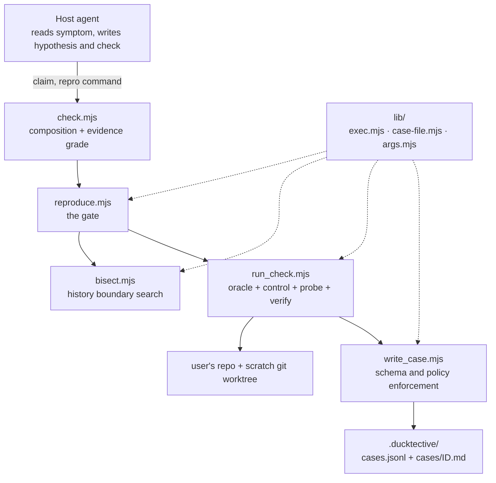
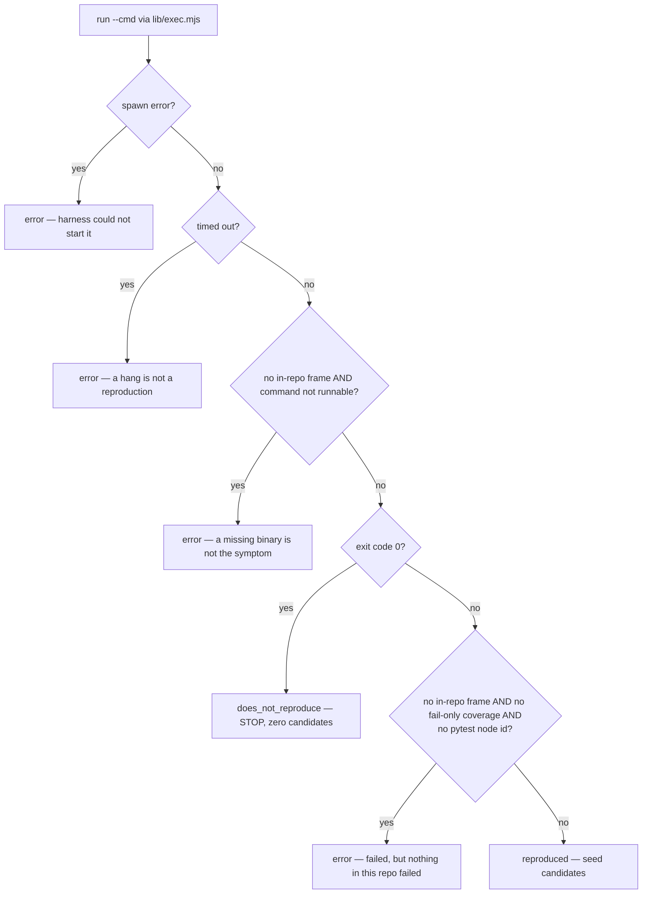
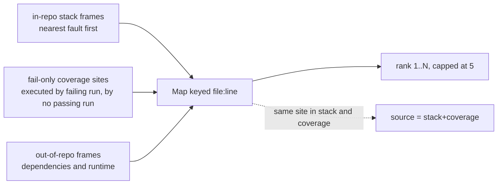
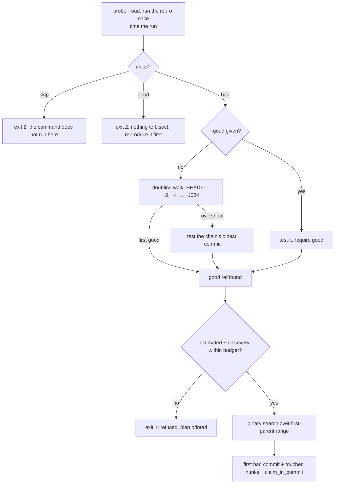
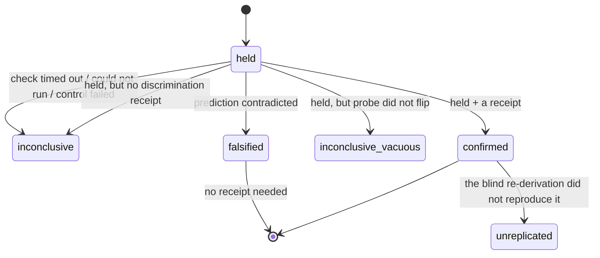
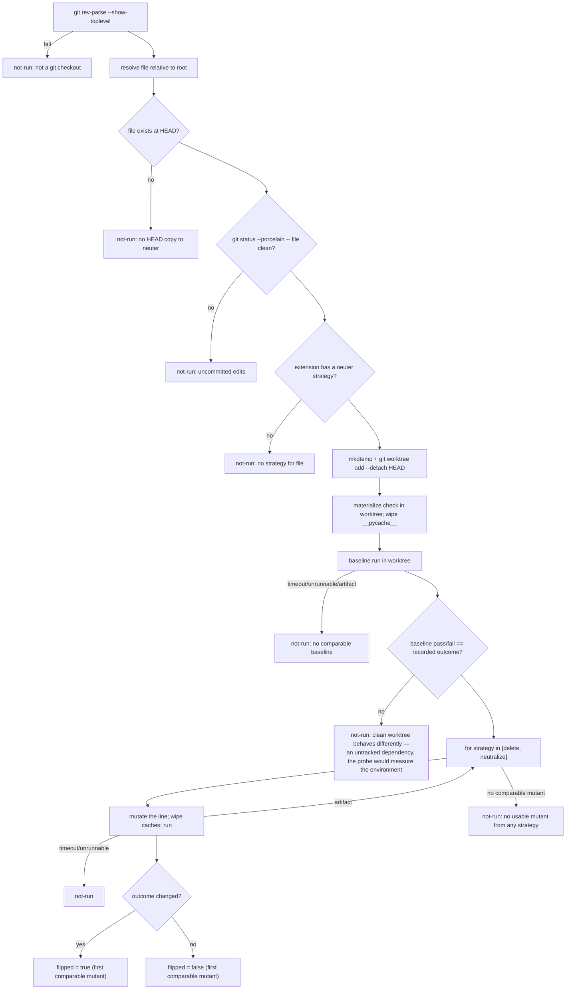
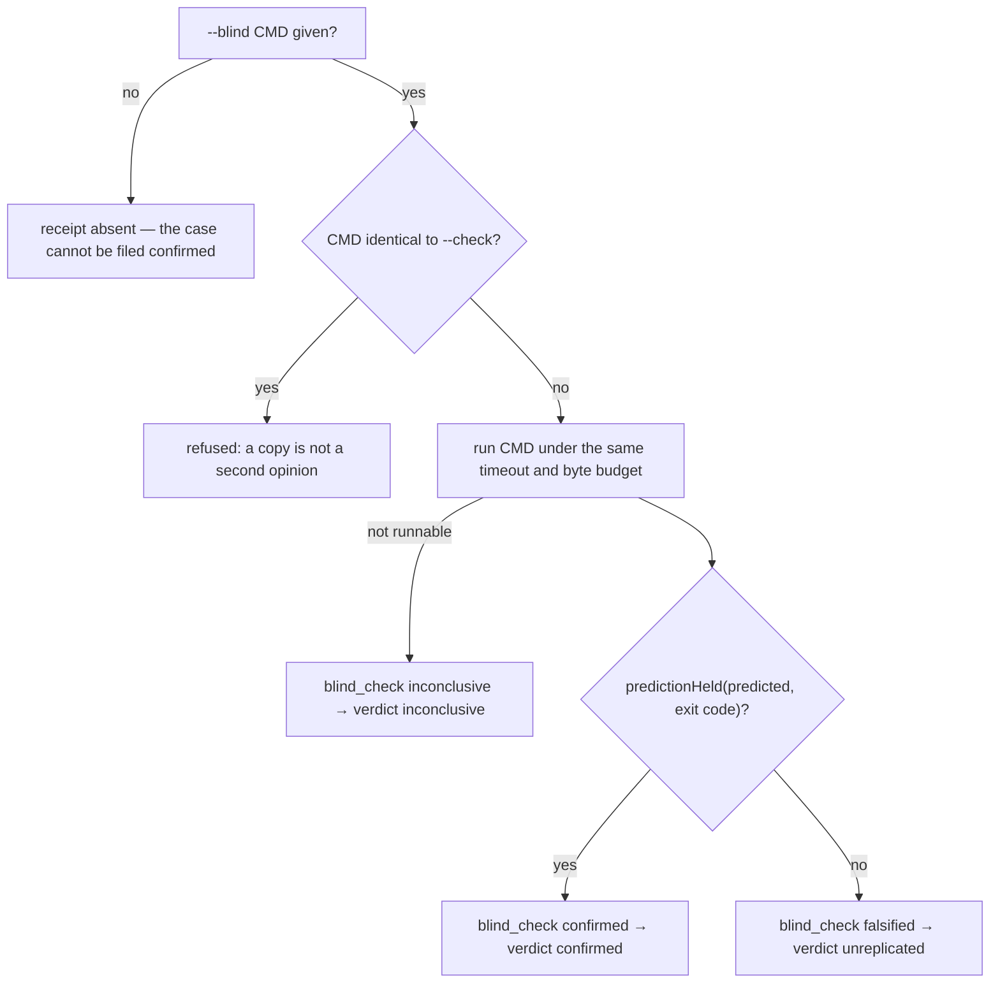
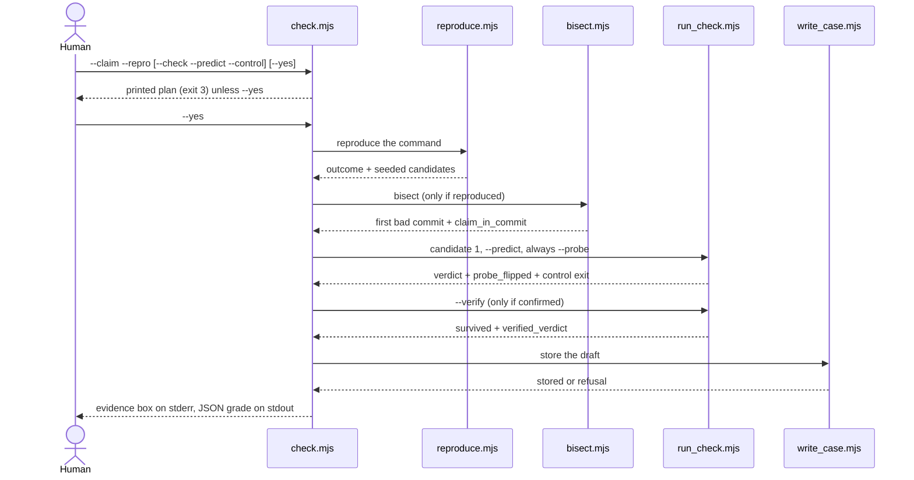

# Ducktective — Architecture

Technical reference checked against commit `74206de` on **2026-09-21**.
The plan is [ducktective-design.md](ducktective-design.md); the rationale and
landscape are in [ref-work.md](ref-work.md); the objection this project was judged
against is kept verbatim in [critique-2026-09-15.md](critique-2026-09-15.md); the
forward plan and the strategy learned from sibling projects are in
[implementation.md](implementation.md); a worked walkthrough is in [guide.md](guide.md)
and a real investigation in [field-run-designer.md](field-run-designer.md). This file
describes the implementation as it is, including the parts that are limits.

**Status:** two Agent Skills — the product (`skills/ducktective/SKILL.md`: one contract,
one schema, four core programs and one composition entry point, all zero-dependency
`.mjs`) and the instrument (`skills/ducktective-bench/SKILL.md`). No website, plugin
manifest, server, database or model runtime. The comparative benchmark in design §4 is
**built but not yet run**: the materialiser, the arm runner with its harness registry,
the OpenCode adapter and the C1–C12 arithmetic exist and are tested with a stub agent,
but there is no two-arm aggregate. One **field run** exists
([field-run-designer.md](field-run-designer.md)): it identified a real bug and confirmed
its fix on real data, which is one investigation, not a measured rate.
`probe()` produces per-case mutation outcomes, not a benchmark score. Passing the
regression suite proves the tools behave as described; it does **not** prove that
Ducktective improves debugging.

**How to read this file.** Sections 1–3 are the shape and the runtime. Sections 4–8
are one algorithm per program, in execution order. Section 9 is the data model and
what each receipt does and does not prove; §10 the store; §11 verification and
measurement; §12 the design-versus-shipped gap; §13 the invariants and the change
protocol. Line anchors (`run_check.mjs:284`) point at the implementation.

---

## 1. The boundary: judgment versus mechanics

Ducktective is split on one line. The host agent supplies everything that is a
judgment: it interprets the symptom, decides what the bug is likely to be, and writes
the check. The tools supply everything that can be made arithmetic: run the command,
parse the evidence, search history, mutate a line, enforce the rules, persist the
result. **No tool establishes that a hypothesis or its oracle is causally correct**;
`run_check.mjs` only establishes that the check agreed with its prediction and that
its outcome moved when the accused line was neutered. That gap is deliberate and
documented per mechanism in §9.

```
skills/ducktective/
  SKILL.md                   single source of the ducktective contract
  case-file.schema.json      strict case-file shape (additionalProperties:false)
  scripts/
    reproduce.mjs            reproduction gate and candidate seeding
    bisect.mjs               regression boundary search (the one tool that adds facts)
    run_check.mjs            check, control, mutation probe and verification
    write_case.mjs           schema/policy enforcement and persistence
    check.mjs                composition entry point for an existing claim
    lib/
      exec.mjs               shell execution, bounded output, process-tree kill, childEnv
      case-file.mjs          schema validator, policy rules, store, Markdown mirror
      verdict-policy.mjs     the shared verdict rule, receipts, reportable gate, cause identity
      args.mjs               shared numeric-flag validation
  bin/install.mjs            installer (not shipped into the destination)
  tests/                     executable regression tests (not shipped)
skills/ducktective-bench/
  SKILL.md                   the instrument: how to run the benchmark
bench/                       benchmark engine
  sources.mjs                declared sources, input validation, instance schema
  agents.mjs                 harness registry: detection + command construction
  materialize.mjs            clone/worktree a repo at its commit; verify the premise
  mine.mjs                   mine a candidate instance from one fix commit
  run.mjs                    run each arm, score the claim, emit C1–C12
  opencode-agent.mjs         OpenCode v2 adapter (prompt + claim)
  report.mjs                 C1–C12 arithmetic
  stub-agent.mjs             model-free agent for tests and CI
corpus/                      verified real instances (designer repo), see corpus/README.md
evals/cases/                 self-authored behaviour corpus, one directory per case
evals/canary.mjs             Tier-1 mutation canary (ranking regression alarm)
evals/canary/target/         the mutated fixture
  ../RUNLOG.jsonl            investigation ledger, not a paired benchmark
scripts/                     repo guards (single source, retired tools, run log)
docs/                        design, critique, guide, plan, field run, and this reference
assets/                      hero image
graphify-out/                generated local navigation data (gitignored)
```

`query_memory.mjs` and the site's duplicate engine are retired. The store remains;
there is no automatic case-similarity ranking and no `spectrum.mjs`. `graphify-out/`
is generated local navigation data, not part of the shipped skill; Prettier and git
exclude it.

---

## 2. Component map



The same tools run standalone under `SKILL.md`; `check.mjs` is a convenience that
shells out to them and grades the result. `check.mjs` invents no evidence of its own:
every row it prints is a fact one of the other tools produced, and a row nobody
attempted is `n/a` rather than a silent pass.

---

## 3. Runtime model: execution, approval, exit codes

### 3.1 `lib/exec.mjs` — one correct way to run someone else's command

`run(command, { cwd, timeout, maxBytes })` is shared by `reproduce.mjs`,
`bisect.mjs`, `run_check.mjs` and `check.mjs` (via child processes). Its behaviour is
a list of bugs that already happened once:

1. **Shell, always.** `--cmd` is a human string such as
   `python -m pytest -q tests/x.py | tail -20`. On Windows a bare `vite` or `pytest`
   has no `.exe` for libuv to find, so `shell: true` is load-bearing.
2. **Bounded capture.** Output accumulates as `Buffer`s against a hard ceiling of
   `max(maxBytes × 20, 1 MB)` per stream; past that the stream is dropped with a note.
   Decoding happens once at the end, so a multibyte character split across a chunk
   boundary is not mangled.
3. **The whole tree dies on timeout.** With a shell the direct child is
   `cmd.exe`/`sh`; killing it alone orphans a hung `pytest`/`node` grandchild. POSIX
   runs the child detached and signals the process group; Windows uses
   `taskkill /PID <pid> /T /F`.
4. **Nested-runner plumbing is removed.** `NODE_TEST_*` variables are deleted from the
   child environment, because a `node --test` that inherits them exits 0 and prints
   nothing, which the gate would read as "does not reproduce".
5. **Signalled means signal.** `code` is `null` when the process was signalled, so a
   timeout can never be mistaken for a passing check.

`wasNotRunnable(result)` answers "could the thing you asked me to run even run?":
true for a spawn error, exit `127`/`9009`, or the "is not recognized / not found"
messages a shell prints instead of raising. This distinction is what stops a typo'd
path from being filed as a reproduction.

### 3.2 Approval is per tool, not a global flag

The non-negotiable is _nothing executes without `--yes`_, but "execution" means
different things in different tools. The honest rule is the table, not the slogan:

| Tool              | Runs a model-authored command | Writes to disk       | Approval required                                  |
| ----------------- | ----------------------------- | -------------------- | -------------------------------------------------- |
| `reproduce.mjs`   | yes (`--cmd`)                 | draft JSON (`--out`) | none — running the repro is the gate's job         |
| `bisect.mjs`      | yes, many times               | optional `--out`     | `--yes`; otherwise exits 3 having run nothing      |
| `run_check.mjs`   | yes (check + control)         | draft, temp script   | `--yes`; otherwise exits 3 having run nothing      |
| `check.mjs`       | yes, via the tools above      | draft + result JSON  | `--yes`; otherwise prints the plan and exits 3     |
| `write_case.mjs`  | no                            | the store            | none; it is the enforcement point, not an executor |
| `bin/install.mjs` | no                            | the destination      | none; `--dry-run` to only plan                     |

Multiline dry runs do not materialise a script. `check.mjs` prints
`approve_with: --yes` on **stdout**, never stderr, so an agent scraping the printed
plan cannot find the approval flag already attached to it.

**This is not a sandbox.** An approved command runs through the user's shell with the
user's privileges and may modify files. A denylist is theatre — any `&&` or backtick
defeats one, and a defeated denylist reads as safety — so the mitigation is that the
human reads the exact command first.

### 3.3 Exit codes

| Tool              | Exit codes                                                                         |
| ----------------- | ---------------------------------------------------------------------------------- |
| `reproduce.mjs`   | 0 reproduced; 1 does not reproduce; 2 harness error                                |
| `bisect.mjs`      | 0 boundary found; 1 refused/error; 2 inconclusive; 3 dry run                       |
| `run_check.mjs`   | 0 recorded verdict; 1 refused; 2 inconclusive/error/failed verification; 3 dry run |
| `write_case.mjs`  | 0 stored; 1 policy/schema refusal; 2 harness error                                 |
| `check.mjs`       | 0 report produced, including negative grades; 3 dry run; uncaught errors fail      |
| `bin/install.mjs` | 0 installed/planned; 1 overwrite refused; 2 error                                  |

A non-zero exit is never "the claim is wrong" except where it is explicitly
documented (`reproduce` exit 1, `bisect` exit 2).

---

## 4. `reproduce.mjs` — the reproduction gate

`reproduce.mjs` is the hard gate. Nothing downstream may reason about the bug until it
exits 0. It runs the exact failing command, captures stdout and stderr, classifies the
outcome from _evidence_, seeds candidate locations, and emits a case-file draft on
stdout (and to `--out`).

Flags: `--cmd` (required), `--cwd`, `--symptom`, `--coverage`, `--baseline`,
`--timeout` (120 s), `--max-bytes` (4000/stream), `--max-candidates` (1–5, default 5,
clamped with a warning), `--out`.

### 4.1 Outcome classification

The order of the branches _is_ the algorithm; several would be ambiguous if reordered.



Notes that matter:

- A non-zero exit is only a reproduction if something **in this repo** failed. Usage
  errors, uncollectable test trees and dependency-only crashes all exit non-zero; none
  is a reproduced symptom. The old design decided this by matching error strings, and
  a real repo whose message matched nothing was filed as `reproduced` with zero
  candidates. `RUNNER_MISUSE` now only chooses the _wording_ of the note
  (`reproduce.mjs:82`).
- `TEST_NODEID` recognises a pytest summary line naming this repo's test
  (`path.py::Class::test`), which can reproduce a failure whose traceback lives inside
  `_pytest`.
- `local` means frames for which `isLocalFile()` is true (below); `localSites` means
  coverage sites marked `inside`.
- `status` is derived from the outcome, not the reverse: `reproduced → open`,
  `error → unverified`, `does_not_reproduce`. `error` describes the reproduction, not
  a verdict, so the only honest status is `unverified`.
- A non-reproducing or errored case carries **zero candidates** (`reproduce.mjs:510`),
  so the draft cannot tempt the next step.

### 4.2 Frame parsing

Test runners disagree about the stream (pytest/unittest write tracebacks to stderr,
`node --test` reports failures on stdout), so both are concatenated before parsing.
Four grammars are recognised (`reproduce.mjs:44`–`69`):

| Grammar       | Pattern                                    | Used by                              |
| ------------- | ------------------------------------------ | ------------------------------------ |
| Python frame  | `File "src/user.py", line 41, in get_user` | Python tracebacks                    |
| V8 frame      | `at getUser (C:/p/src/auth.ts:41:12)`      | Node stack traces                    |
| Location line | `test_money.py:5: AssertionError`          | pytest (no `File "…"` for an assert) |
| Diagnostic    | `src/app.test.ts(64,52): error TS2353: …`  | `tsc`, `vue-tsc`, webpack, ESLint    |

Ordering is **nearest-fault first**, and it is derived from the syntax that matched,
not from the detected runner:

- Python prints the **outermost** call first, so the throwing frame is last → the
  Python list is reversed.
- V8 prints the throw site **first** → kept in order.
- Location and diagnostic lines already name the failing spot → kept in order.

`parseFrames()` returns `[...py.reverse(), ...loc, ...js]` (`reproduce.mjs:294`).
`node:` frames are dropped as runtime plumbing, and paths are repo-relative where they
are inside `--cwd` (`repoRelative`), so `location` survives a different checkout.

### 4.3 What counts as an in-repo file

`isLocalFile()` is a pure string test, and every clause exists because of a real
misclassification:

- not absolute-like — Windows drive (`C:\`), leading `/`, or UNC `\\`;
- not `../…` — outside the checkout;
- not a pseudo-location — `<string>`, `<stdin>`, `[eval]`: "not absolute" alone used to
  call these in-repo evidence;
- not vendored — `node_modules`, `.venv`, `site-packages`, `__pycache__`, `vendor`,
  `.tox`, `.nox`.

The path helpers (`baseName`, `isAbsoluteLike`) are hand-rolled over both separators
so the same traceback classifies identically on Windows and Linux
(`reproduce.mjs:191`–`227`). A case file is meant to outlive the machine that wrote it.

### 4.4 Candidate seeding

`seedCandidates(frames, sites, maxCandidates, assertion)` (`reproduce.mjs:405`) builds a
map keyed by `file:line` and emits at most `maxCandidates` leads, ranked:



The precedence rule is a policy: local leads first, dependency/runtime frames last
("a traceback that only touches site-packages is a clue about the environment, not the
bug"). A site seen in both the traceback and fail-only coverage is merged to
`stack+coverage`, and the generated `why` says which evidence produced the lead. A
candidate is an empty hypothesis plus `verdict: "pending"` — the tool does not
hypothesise.

Coverage has **two roles, kept apart** (`reproduce.mjs:456`):

- `reproduction.covered` records what the failing run executed, with or without a
  baseline — an inventory a human may want.
- Only **fail-only** sites, those a passing run never touched, become candidates. A
  baseline-less inventory is not a localization signal, so it is recorded but never
  ranked. Warning-and-ranking at the same time is the illogical state that was removed.
- `--baseline` is what turns coverage into a signal; without it the gate adds a note
  naming exactly how to collect one (`coverageHint`, only when the command's first
  token is a Python interpreter that can `import coverage`).

### 4.5 Draft and exit

The draft is validated against `case-file.schema.json` before it leaves the process.
A schema violation is reported to stderr but does not stop the output — the shape
validator is the store's job to enforce; the gate's job is to record what it ran.
`--out` creates parent directories (`mkdirSync recursive`), because failing there
would have thrown away a reproduction that had already run. Exit is `0` reproduced,
`2` error, `1` does not reproduce.

---

## 5. `bisect.mjs` — history boundary search

This is the only tool that produces a fact the host agent did not already have. For any
regression with a reproducing command, `git bisect`-style search names the commit that
broke it in O(log n) runs, with no model in the loop. It runs in the **user's working
tree**, because a scratch worktree would not have the untracked `.venv` / `node_modules`
the repro needs.

Flags: `--cmd` (required), `--good`, `--bad` (default `HEAD`), `--claim`, `--repo`,
`--repeat` (default 1), `--budget` seconds (default 600), `--timeout`, `--out`, `--yes`.

### 5.1 Preconditions and refusals

Before anything runs, `bisect.mjs` refuses:

- a directory that is not a git repository;
- a repo already mid-bisect (`.git/BISECT_LOG` exists);
- a tree with uncommitted changes. The single exemption is the untracked root
  `.ducktective/` store, because the case files live there and are not code under test
  (`bisect.mjs:203`).

`restore` is captured first — the current branch, or the commit if `HEAD` was already
detached — and a `finally` attempts to check it back out; restoration failure is
reported with exit 1.

### 5.2 The search



**Grade function.** Each reproduction run is classified the way `git bisect run` wants
it (`bisect.mjs:125`): timeout or exit `125` → `skip`; exit `0` → `good`; anything else
→ `bad`. With `--repeat N`, disagreement across runs is `flaky`, never a commit.

**Green-ref discovery (doubling).** With no `--good`, the tool walks `bad~1, ~2, ~4 …`
up to 1024, resolving every ref to a SHA _before_ checking anything out — `HEAD~4` means
a different commit once `HEAD` has moved, and a walk that re-anchors itself stops early
and reports `no-good-ref` wrongly (`bisect.mjs:313`). When the grid overshoots history,
the oldest first-parent commit is tested too, because it is the one candidate the grid
may have skipped. This is a guess at the floor of the regression, not a search for the
first green commit; the result says which ref it used.

**Range and complexity.** The search space is the **first-parent** chain
(`git rev-list --first-parent <bad>`), sliced between `good` and `bad`. Merges are not
dropped: `--no-merges` leaves side-branch parents interleaved by date, which is not a
history order and lets the search blame an innocent commit. `range[0]` is the bad tip;
the virtual index `range.length` is `good`. On that array "is bad" is assumed monotone
(newer bad, older good), which is exactly the assumption a fix/reintroduction history can
violate.

```
chain (newest first):   [bad .. ] [range: commits strictly newer than good] [good .. root]
range index:              0 ........ lo/boundary ........ hi ........ range.length == good
search: binary, lo = last known bad, hi = first known good, ceil(log2 n) probes.
```

**Pricing.** One measured run at `--bad` prices the whole walk:
`steps × --repeat × measured_run_ms`, where
`steps = max(1, ceil(log2(max(count, 2))) + 1)` and `count` is the number of commits
between. The budget covers the whole wall clock the tool has spent, so discovery time
already elapsed is included; the refusal reports both. The budget is **not a hard
deadline** for subsequent commands — each run keeps its own `--timeout`.

**Termination.** An untestable midpoint (`skip`) stops the search conservatively with
`bisected: false`, `skips` counted, and an interval ordered
`[good boundary, bad boundary]` — it is never assumed green. A flaky midpoint aborts
with `flaky: true`. The search is driven here rather than by `git bisect run`, because
that would need a shell wrapper that differs per platform; this leaves no bisect state
behind.

### 5.3 Diff parsing and `claimInCommit`

`parseTouched()` (`bisect.mjs:172`) reads `git show --format= -U0`:

- `+++ b/<path>` starts a file;
- `@@ -a[,b] +c[,d] @@` records `[c, c+d-1]` (`d` defaults to 1, `d = 0` collapses to
  `[c, c]`);
- `a/dev/null` entries are dropped.

`claimInCommit(claim, touched)` (`bisect.mjs:151`) turns `--claim "app.py:41 fn()"` into
`{file, line}` and answers:

| Situation                                        | Verdict | Why                                          |
| ------------------------------------------------ | ------- | -------------------------------------------- |
| No `--claim`                                     | `n-a`   | the commit stands alone                      |
| `--claim` that is neither a file nor `file:line` | `n-a`   | a malformed claim must not read as a finding |
| File not among the touched files                 | `no`    | with the file count in the reason            |
| File present, no line given                      | `yes`   | file-level match only                        |
| File present, line falls in a hunk               | `yes`   | `file:line` sits inside a changed hunk       |
| File present, line outside every hunk            | `no`    | the hunks are listed in the reason           |

Hunk overlap is **supporting evidence, not ground-truth cause correctness**: an enabling
commit can expose an older defect, and the result carries that caveat verbatim. A bare
word with no dot or slash is not a file, so it cannot be scored `no` and turned into a
finding.

---

## 6. `run_check.mjs` — oracle, control, probe, verify

`run_check.mjs` executes the model's check and decides the verdict by arithmetic from
two facts: what the hypothesis predicted, and what the process actually returned.

Flags: `--file` and `--candidate` (rank or unique location substring) and `--predict`
(or `--verify`) required; optional `--cmd`, `--control`, `--hypothesis`, `--depth`
(default 2, max 5), `--lang py|js|sh`, `--probe`, `--cwd`, `--repo`, `--timeout`
(60 s), `--max-bytes`, `--rerun`, `--escalate`, `--keep`, `--yes`.

### 6.1 Sequencing: one candidate hard before escalating

`blockers(candidates, index, {escalate})` (`run_check.mjs:201`) refuses to touch a
candidate while an earlier one is unfinished:

| Earlier verdict        | Blocks?             | Why                                                              |
| ---------------------- | ------------------- | ---------------------------------------------------------------- |
| `pending`              | always              | never tested, so it must not unlock the next one                 |
| `inconclusive`         | unless `--escalate` | the check timed out / could not run / control also failed        |
| `inconclusive_vacuous` | unless `--escalate` | the check never depended on the accused line                     |
| `confirmed`            | unless `--escalate` | the doc says confirmed means stop; `--depth 1` forbids even that |
| `falsified`            | never               | rejection is a verdict; move on                                  |

Other refusals, in order (`run_check.mjs:590`): `--verify` needs a recorded
prediction and exit code; a candidate with no hypothesis (rule 4); a candidate that
already has a verdict unless `--rerun`/`--verify`; the draft's reproduction outcome is
not `reproduced` (the gate said stop); the candidate rank is past `--depth`. The draft
is schema-validated _before_ any path is built from it, because `id` names a file this
tool writes and then executes.

### 6.2 Multi-line checks

The smallest falsifying artifact is often a five-line script, and both Python and Node
resolve relative imports against the _script's_ directory — `.ducktective/checks/x.py`
could not import the code under test. `materialize()` (`run_check.mjs:243`) therefore
writes a multi-line check into the **repo root** as
`ducktective-check-<caseId>-<rank>.<ext>`, sniffs the shebang or takes `--lang`, and
refuses an unsafe case id with the same `CASE_ID` guard the store uses (this was a
write-then-run outside the repo). The script is deleted after the run unless `--keep`;
the full source is recorded in `check`, so the case still replays. Single-line checks
run as-is.

### 6.3 `classify()` — the verdict lattice



`classify(predicted, check, control, timeout, {controlPassed, probeFlipped, blind})` is a
thin delegation to `classifyVerdict()` in `lib/verdict-policy.mjs`, which owns the rule and
shares it with the store's refusal checks (`run_check.mjs:284`,
`lib/verdict-policy.mjs`):

```text
if check.timedOut                       → inconclusive("the check hung")
if notRunnable(check) or code not int   → inconclusive("could not run at all")
if control and control failed/timed out → inconclusive("control also failed")
held = (predicted == "pass") == (check.code == 0)
if not held                             → falsified
if probeFlipped == false                → inconclusive_vacuous
if predicted == "pass" and probeFlipped != true
                                        → inconclusive("pass needs a flipped probe")
if not controlPassed and probeFlipped != true
                                        → inconclusive("no discrimination receipt")
if blind ran and did not hold           → unreplicated("not confirmed by a fresh context")
                                        → confirmed
```

The arithmetic in the `held` line is the whole point: for `--predict fail`, `held` is
`exit != 0`; for `--predict pass`, `held` is `exit == 0`.

**Why a receipt is required.** A matching prediction proves the check _agrees_ with the
hypothesis. A passing control proves it is _not always-fail_. Neither proves it is not
_always-pass_, and neither proves its outcome depends on the accused line. An
always-pass oracle agrees with any prediction, with full provenance — which is the
confident wrong answer this project exists to catch, previously storable as
`confirmed`. So:

- `--predict fail` needs a passing `--control` **or** a flipped `--probe`.
- `--predict pass` needs a flipped `--probe`; a passing control cannot distinguish an
  always-pass check.
- A non-flip is `inconclusive_vacuous`, which is not a weaker `confirmed` — it says the
  check was never about the suspect.
- A flip shows **sensitivity under that mutation**, not that the accused line is faulty.
  A non-flip shows **no detected sensitivity**, not that execution never touched the
  line. Both notes are recorded.

### 6.4 `probe()` — neuter the line on a scratch worktree

`probe()` (`run_check.mjs:403`) answers "does the check's outcome depend on the accused
line?" by mutating the line in a disposable `git worktree` at `HEAD` — never the user's
tree — and re-running the same check there.



Key implementation facts:

- **The worktree is compared to the real tree first.** It has neither untracked source,
  the repo's `.venv`, nor `node_modules`. If the check does not even reproduce its
  recorded outcome there, the mutant run would measure the environment, and the probe
  says so instead of concluding. Missing untracked dependencies are the common cause.
- **Neuter strategies** (`run_check.mjs:356`):

  | Family        | Strategy 1 `delete`      | Strategy 2 `neutralize`    |
  | ------------- | ------------------------ | -------------------------- |
  | Python        | `# dt-probe <original>`  | `<indent>pass  # dt-probe` |
  | JS/TS/MJS/CJS | `// dt-probe <original>` | `<indent>;  // dt-probe`   |

  Delete is sharpest — it removes exactly the accused computation. But deleting an
  indented sole body line (`def f():\n    return x`) breaks the block parse, so the
  original line is retried with a syntactically silent stand-in. This is an artifact
  fallback, not a search through all strategies for the first flip.

- **Aborting before the line is the wrong strategy** and is not used: a check that
  already fails keeps failing when the code above it dies, so exit-code comparison
  would report "no change" about a line that mattered enormously. Neutralizing keeps
  the process alive, so surviving is real evidence.
- **Artifacts are not evidence.** A mutant that produces a parse or undefined-name
  error (`MUTATION_ARTIFACT`, `run_check.mjs:380`) "crashed differently" and is not
  scored; the tool tries the next strategy. If every strategy is an artifact, the
  honest answer stays `not-run`, never `inconclusive_vacuous`.
- **`__pycache__` is wiped** before the baseline and every mutant. Python validates
  bytecode by `(mtime, size)`, and `pass  # dt-probe` is exactly as long as many
  replaced lines, so a same-second rewrite can import stale baseline bytecode and fake
  either a flip or a no-change.
- **The first comparable mutant returns**, flip or not; exhaustion returns
  `flipped: null` with reasons. The worktree is always removed and pruned in a
  `finally`.

Mutation is **physical-line based**, not syntax-tree or logical-line aware. Inversion,
numeric perturbation and sentinel-return strategies from design §E2 remain
unimplemented.

### 6.5 `--blind` — the stripped-context re-derivation

`--blind "<command>"` answers the question a first run cannot answer about itself:
did a check written **without this run's context** reach the same conclusion? The
prediction, control and probe are all graded by the same context that wrote the
check, so none of them can see a check that is confidently about nothing. The
blind check is authored as if from the symptom, the reproduction, the candidate
`location` and the recorded `check` alone, then executed by `run_check.mjs`.



Recorded on the candidate as `blind_check` (`verdict`, `check`, `exit_code`,
`evidence`). `write_case.mjs` refuses a `confirmed` whose `blind_check.verdict` is
not `"confirmed"`; a non-reproduction is filed `unreplicated`, never `falsified`.

**What each part proves, and what it does not.**

- The exit code and evidence are **captured by the tool from a real process**, so
  the receipt is executed, not a hand-typed verdict.
- The **context separation is the host's obligation, not the tool's.** run_check
  receives a command string; it cannot prove the author wrote it without the first
  run's chat history, nor that a different context produced it. A host that retypes
  the original check and changes a constant satisfies the tool while defeating the
  mechanism.
- So `blind_check` is a **protocol receipt, not structural separation** — the
  strongest thing this architecture can enforce (it executes what the host
  attests) and weaker than an independently spawned second agent. The gap is named
  here rather than implied. It is the honest ceiling of a skill that embeds no
  model runtime.
- A non-reproduction is `unreplicated` — held, but not replicated — **not**
  `falsified`: the first run may still be right about a check that happened not to
  generalize.

Default-on, deliberately: the failure this guards (a confident check about
nothing) is silent, so an opt-in flag is skipped exactly when it is needed. A case
cannot reach `confirmed` from one context. Same machine and working tree
throughout, so this tests authoring independence, not environmental independence.

### 6.6 Recording, `--verify`, and evidence

On a first run, `run_check.mjs` records on the candidate: `check` (runner command plus
the materialized source), `predicted`, `check_exit_code`, `verdict`, `evidence`
(check/control/probe blocks and notes), `control`/`control_exit_code` when given, and
`probe`/`probe_exit_code`/`probe_flipped` when `--probe` was asked for. "It could not
run" is recorded as `probe_flipped: "not-run"`, not as an absent field: a missing
receipt must be visible to `write_case.mjs`.

`--verify` re-executes the decided candidate's own oracle, records
`verified_exit_code` and `verified_verdict`, and refuses `--cmd` replacement: a second
guess cannot move the answer. `survived = verdict === cand.verdict`. This is a fresh
process on the same machine and tree — a flaky-oracle test, **not** a portability or
independent causal validation. A claim that did not survive exits 2, because it is a
finding, not a success.

`--probe` is only run once the prediction has held: a falsified candidate needs no
discrimination receipt, since rejecting a hypothesis is the half that was never broken.
The prediction is graded provisionally first (as if the receipt were coming), because
demoting before the probe would mean the probe never runs.

Exit: `0` recorded, `2` for `inconclusive`/`inconclusive_vacuous` (a harness-level
result should leave a non-zero trace), `1` refused, `3` dry run.

---

## 7. `check.mjs` — the composed verdict

`check.mjs` grades a root-cause claim the agent already made. It composes the other
tools and invents nothing. Flags: `--claim` and `--repro` (required), `--check`,
`--predict`, `--control`, `--repo`, `--skip-bisect`, `--budget`, `--timeout`, `--out`,
`--yes`.

### 7.1 Sequence



When `--check` is given, `check.mjs` replaces the seeded candidates with the supplied
claim as candidate 1 (`check.mjs:324`) — it is a claim evaluator, not an autonomous
candidate-search loop. It writes `.ducktective/draft.json` and `.ducktective/check.json`
(override with `--out`).

### 7.2 Rows and the grade

Each row is `[id, label, state, evidence]` where state is `yes` (a tool proved it),
`no` (a tool disproved it), or `n/a` (nobody attempted it). **There is no "asserted"
state**: a claim cannot earn a point by being stated confidently.

| Row id           | Proved by                                               |
| ---------------- | ------------------------------------------------------- |
| `reproduces`     | `reproduce.mjs` outcome                                 |
| `regression`     | `bisect.mjs` found a first bad commit                   |
| `claim ∈ commit` | the claim's line sits inside a hunk that commit changed |
| `discriminates`  | `--probe` flipped when the accused line was neutered    |
| `control`        | `--control` passed on the known-good path               |
| `prediction`     | `--predict` agreed with the executed exit code          |
| `survives`       | `--verify` re-ran the claim and it held                 |

`grade(rows)` (`check.mjs:132`):

```text
earned      = count(state == "yes")
disproved   = count(state == "no")
ratio       = earned / rows.length
contradicted = any(id in {prediction, survives} and state == "no")
repro        = state of the "reproduces" row
letter = contradicted or repro == "n/a" ? "F"
       : repro == "no"                    ? "n/a"
       : ratio >= 0.9 ? "A" : ratio >= 0.7 ? "B" : ratio >= 0.5 ? "C" : "D"
```

- An uncontested hunk miss is **not** a disproof (an enabling commit can expose an
  older bug), so it does not cap the grade; a contradicted prediction or failed re-run
  does.
- A stale ticket is not a bad grade: `repro == "no"` yields `n/a`, because refusing to
  name a cause for something that does not reproduce is the behaviour the project
  rewards.
- A harness that never ran (`repro == "n/a"`) is an F.
- The letter measures **evidence completeness**, not the probability that the cause is
  correct. It is printed with that note. Exit 0 means the report was produced, not that
  the claim was confirmed or the case stored; callers must inspect the result.

Unattempted rows count against the denominator, which is the whole point of a receipt.

---

## 8. `write_case.mjs` and `lib/case-file.mjs` — the enforcement point

`write_case.mjs` reads a case (JSON from `--file` or stdin), refuses it if it breaks the
schema or the hard rules, and otherwise appends it to the store. A refusal means the
investigation is wrong — fix the investigation, not the JSON.

```mermaid
flowchart TD
  IN["case file JSON"] --> S["validateSchema against case-file.schema.json"]
  S -->|problems| REF["exit 1: REFUSED<br/>list every reason"]
  S -->|clean| P["policyViolations — the hard rules"]
  P -->|problems| REF
  P -->|clean| W["writeCase"]
  W --> J["`.ducktective/cases.jsonl`<br/>upsert one line per id"]
  W --> M["`.ducktective/cases/ID.md`<br/>Markdown mirror"]
```

### 8.1 The schema validator

`validateSchema` (`case-file.mjs:44`) is a hand-rolled subset of JSON Schema, kept small
so the skill stays a copy-one-folder install with zero dependencies. It implements:
single or union `type`, `enum`, `required`, `properties`, `items`, `pattern`,
`maxItems`, and `additionalProperties: false` at every level. Unknown keys are
rejected: a misspelled field otherwise validates and later reads as `undefined`, which
is how a case file quietly loses its confidence or its candidates.

### 8.2 `policyViolations()` — the hard rules the schema cannot state

The candidate-level rules and the confirmation arithmetic live in
`lib/verdict-policy.mjs` (`candidateViolations`, `classifyVerdict`), so `run_check.mjs`
and the store compute the same thing and cannot drift; `verdict-policy.test.mjs`
asserts the schema enums and the policy sets agree. The case-level rules stay here. Any
non-empty result refuses the write.

| #   | Rule                                                                       | Refusal if broken                                                                                                      |
| --- | -------------------------------------------------------------------------- | ---------------------------------------------------------------------------------------------------------------------- |
| 1   | A symptom must be recorded                                                 | empty `symptom`                                                                                                        |
| 2   | Nothing reasons about a bug that never failed                              | non-`reproduced` outcome with candidates, or status `confirmed`                                                        |
| 3   | Every decided candidate states a hypothesis                                | verdict ≠ `pending` with an empty hypothesis                                                                           |
| 4   | A verdict is an executed check                                             | `confirmed`/`falsified`/`inconclusive_vacuous` needs `check`, `evidence`, `predicted`, and a numeric `check_exit_code` |
| 5   | A verdict must not contradict its own arithmetic                           | `predicted`+exit implies the other verdict                                                                             |
| 6   | A claim that failed re-execution cannot be filed as the original           | `verified_verdict` differs from `verdict`                                                                              |
| 7   | A control that also failed is not an oracle                                | `confirmed` with numeric `control_exit_code ≠ 0`                                                                       |
| 8   | `confirmed` owes a discrimination receipt                                  | no passing control **and** no flipped probe                                                                            |
| 9   | `confirmed` cannot coexist with a non-flip                                 | `probe_flipped: "no"`                                                                                                  |
| 10  | A pass prediction needs a flipped probe                                    | `predicted: "pass"` with `probe_flipped ≠ "yes"`                                                                       |
| 11  | `inconclusive_vacuous` is the probe's finding, not a word for a weak check | `probe_flipped ≠ "no"`                                                                                                 |
| 12  | A cause, or strong confidence, only travels with a confirmed status        | `confirmed_cause` or `high`/`medium` confidence without `confirmed`                                                    |
| 13  | Status `confirmed` needs a confirmed cause and a real confidence           | no confirmed candidate, or missing `confirmed_cause`, or `none` confidence                                             |
| 14  | Unverified work is labelled, never presented as a cause                    | `unverified`/`exhausted` needs `leading_hypothesis`, no confirmed candidate                                            |
| 15  | A patch follows a confirmed cause                                          | `suggested_patch` without `confirmed`                                                                                  |

These are consistency checks over **supplied records, not authenticated execution
attestations**. Fabricated evidence or a poor oracle can still satisfy the arithmetic;
the tool narrows the space of confident wrong answers, it does not eliminate it.

### 8.3 The store

`readStore` (`case-file.mjs:331`) returns `raw` lines and parsed `rows` that are
index-aligned; unparseable lines parse to `null` and are preserved, because a rewrite
that rebuilds the file from parsed rows alone deletes whatever the parse skipped.
`writeCase` upserts by `id` — an updated case rewrites its own line instead of piling
up copies — and writes both files via temp-file + rename
(`writeAtomic`, `case-file.mjs:357`). It also derives a **cause identity**
(`cause_hash`/`cause_key`) and upserts `<repo>/.ducktective/causes.jsonl`, so a
repeated root cause increments `count` instead of adding a near-duplicate row;
`write_case.mjs --causes` prints that index, most recurrent first. The JSONL and
Markdown pair is **not one transaction**, and neither is the cause index. `newCaseId()` is `DT-YYMMDD-<6 hex>`, sortable by day with a collision
guard. `CASE_ID` is `^DT-[A-Za-z0-9][A-Za-z0-9-]{0,31}$` — no `/`, `\` or `.`, which is
exactly what a prefix-only guard failed to forbid. `repoRoot()` walks up to `.git` and
falls back to the starting directory, never the filesystem root, so a tarball or CI
checkout does not create `.ducktective/` next to `C:\Users` or `/`.

---

## 9. Data model and what each receipt proves

### 9.1 Case-file shape

```text
case
├─ id                       DT-YYMMDD-hex
├─ opened_at                ISO 8601
├─ symptom                  verbatim, one paragraph
├─ reproduction
│   ├─ command              exact command run
│   ├─ outcome              reproduced | does_not_reproduce | error
│   ├─ duration_ms
│   ├─ exit_code            number|null (null = signalled / never started)
│   ├─ runner               pytest | unittest | node-test | unknown
│   ├─ stdout / stderr      clipped, head and tail kept
│   ├─ stack[]              raw frame lines
│   └─ covered[]            {file, line} executed by the failing run
├─ candidates[]  (max 5)
│   ├─ rank, location, why, hypothesis, check, evidence
│   ├─ verdict              pending | falsified | confirmed | inconclusive | inconclusive_vacuous | unreplicated
│   ├─ predicted            pass | fail
│   ├─ check_exit_code      number|null
│   ├─ control, control_exit_code
│   ├─ probe, probe_exit_code, probe_flipped   yes | no | not-run
│   ├─ probe_attempts[], probe_artifact        per-strategy outcomes (C7)
│   ├─ blind_check          executed stripped-context re-derivation receipt (design v3 E2)
│   └─ verified_exit_code, verified_verdict
├─ confirmed_cause          string|null
├─ leading_hypothesis       string|null
├─ confidence               high | medium | low | none
├─ cause_hash, cause_key    derived cause identity + audit tuple
├─ count                    distinct cases sharing cause_hash (derived)
├─ cause_confidence         derived 0..1 rating, persisted by writeCase
├─ not_reportable           reason the case may not be surfaced, or null
├─ suggested_patch          string|null
├─ status                   open | confirmed | does_not_reproduce | exhausted | unverified
└─ notes
```

Required keys are `id`, `opened_at`, `symptom`, `reproduction`, `candidates`, `status`,
`confidence`; every object rejects unknown properties. The authoritative shape is
[`case-file.schema.json`](../skills/ducktective/case-file.schema.json), and `SKILL.md`
carries the field names as the contract. `open` exists so a mid-flight case can be
persisted; SKILL.md forbids patching from it. `error` describes the reproduction, not
the verdict, so an unanswered question is `unverified` with the harness note in
`leading_hypothesis`.

### 9.2 Evidence semantics — the honest table

This is the heart of the architecture. Each mechanism buys a specific, bounded fact.

| Mechanism                           | Proves                                                           | Does **not** prove                                                                 |
| ----------------------------------- | ---------------------------------------------------------------- | ---------------------------------------------------------------------------------- |
| Reproduction gate (`reproduce.mjs`) | the symptom occurs now, in this repo, on this command            | that the ticket is stale when it does not reproduce                                |
| Traceback ordering                  | which frames are near the fault                                  | that the nearest frame is the cause                                                |
| Fail-only coverage                  | a line the failing run executed and no passing run did           | that the line is faulty; coverage is a weak fault proxy                            |
| `--predict` vs exit code            | the check agreed with the hypothesis                             | that the check tested anything about the accused line                              |
| `--control`                         | the check is not always-fail                                     | that the check is not always-pass                                                  |
| `--probe` flip                      | the check's outcome is sensitive to the line under that mutation | that the line is faulty                                                            |
| `--probe` non-flip                  | no sensitivity detected under that mutation                      | that execution never touched the line                                              |
| `--verify`                          | a fresh process reached the same verdict on the same machine     | portability, or independent causal validation                                      |
| `--blind` (executed second check)   | a differently written check fails/passes the same way            | that it was authored without the first run's context; same tree and machine        |
| `--blind` non-reproduction          | the claim was not replicated → `unreplicated`                    | that the first cause is wrong                                                      |
| `bisect` + `claim_in_commit`        | the blamed commit's hunks contain the accused line               | that the commit introduced the defect (an enabling change can expose an older one) |
| `--probe` on a clean worktree       | the check behaves the same without untracked deps                | that the dependency set matches the user's for all cases                           |
| Guard suite (`npm test`)            | the tools behave as documented                                   | that Ducktective improves debugging                                                |

The store's own consistency rules are arithmetic over the receipts above. They are not
authentication: fabricated evidence can satisfy arithmetic. This is stated in the tool,
not hidden in a doc.

---

## 10. Markdown mirror

`renderMarkdown` (`case-file.mjs:252`) writes the same facts in reading order to
`.ducktective/cases/<id>.md`, which is the file a human opens in 30 seconds. It renders
status and confidence, the reproduction command and outcome, the raw stack and clipped
stderr, the fail-only sites, every candidate with its hypothesis, probe result and
evidence, the confirmed cause or leading hypothesis, an optional secondary patch, and
notes. Long evidence is clipped keeping both ends, because pytest's failure summary and
a traceback's exception sit at the tail. The JSONL is the record another skill may read
one day; the Markdown is what a person reads tomorrow morning. Both are written in the
same call so they cannot disagree.

---

## 11. Verification, measurement and maintenance

Checked on **2026-09-21**, against `a7b4755`: `npm test` passed **213/213** locally
(source: the Node test runner, including real subprocess and temporary-repo tests; a
local run took ≈ 30 s). This is regression evidence, not a product-effectiveness
estimate.

| Layer              | Command                                | What it can prove                                                                                                                                                                            |
| ------------------ | -------------------------------------- | -------------------------------------------------------------------------------------------------------------------------------------------------------------------------------------------- |
| Guards             | `npm test`                             | the `ducktective` contract has exactly one `SKILL.md` (other skills are allowed); every shipped tool named in `SKILL.md` and here; installer coverage; `docs/architecture.md` tracked by git |
| Unit + integration | `npm test`                             | frame order, the evidence rule, id containment, policy refusals, tree-kill, bounded capture, installer behaviour                                                                             |
| Behaviour corpus   | `npm run eval`                         | the tools act as documented against real pytest/unittest/`node:test`/coverage.py runs — **self-authored cases**, so a regression net, not evidence of value                                  |
| Mutation canary    | `npm run canary`                       | candidate ranking did not regress since last night; mutants are easier than real faults, so a regression alarm, never product evidence                                                       |
| Run log            | `node evals/runlog.mjs --report`       | counts derived from case files, split by provenance                                                                                                                                          |
| Lint / format      | `npm run lint`, `npm run format:check` | style gates; not run by CI's only lane                                                                                                                                                       |

- `evals/cases/` holds one directory per case with a `case.json` naming a real command
  and the expected conclusion. `evals/run.mjs` runs `reproduce.mjs` with the case
  directory as cwd and reports four harness-measurable numbers: stale tickets stopped,
  broken commands refused, nearest-fault ranking, and cases behaving exactly as
  specified. It can measure the gate; it cannot tell you the gate is the one the plan
  asked for.
- `evals/canary.mjs` (`npm run canary`) mutates `evals/canary/target/calc.mjs`, keeps the
  mutants its tests kill, and asks `reproduce.mjs` whether the first lead is the line it
  broke; survivors must return no candidate. First measured run: 88% cause-hit@1 on
  killed mutants, 100% no-candidate on survivors; on this repo's own `bench/report.mjs`
  it is 25% (crash-shaped mutants 100%, value mutants 0%, because JS seeding is
  traceback-only). It runs nightly in `canary.yml`, never on the PR path, because it is
  a regression alarm — mutant-shaped bugs are not real faults.
- [`docs/field-run-designer.md`](field-run-designer.md) records a **field run** of the
  product on a repository it did not author: 43 opening-cut anomalies on the pre-fix
  commit `6e55c0f0`, 0 on the fix `9095f188`, confirmed through the gate with a passing
  control. One investigation, not a measured rate.
- `evals/RUNLOG.jsonl` is one row per investigation, with a `provenance` column
  (`real` vs `constructed`) so fixtures are never laundered into evidence. `runlog.mjs`
  derives M1–M3 from the case file and M4 (`case file changed a decision`) is the only
  human-reported metric. Blank means "nobody recorded it", never "no". The retired
  M5–M9 flags now fail rather than silently dropping data.
- The run-log test caught a real defect where rows were parsed with `line[i]`
  (characters, not fields), reporting "0 real cases" against real rows and never
  raising — the worst kind of bug in a project whose pitch is measurement.
- `scripts/skill-single-source.test.mjs` is the guard that keeps this file honest: it
  fails if a second `SKILL.md` appears, if a shipped tool is never mentioned by exact
  filename here, or if `docs/architecture.md` is untracked. `.github/workflows/eval.yml`
  runs `npm test` and `npm run eval` on `skills/**` and `evals/**` changes; a docs-only
  change does not trigger it.

The paired benchmark in design §4 (extended by design v3 with C8 blind-checker overturn
rate and C9 why/evidence violations) is **built but not yet run**. `bench/` holds its
capture path — source validation, the **local materialiser** (`bench/materialize.mjs`),
the **arm runner** (`bench/run.mjs`) with a **harness registry** (`bench/agents.mjs`,
auto-detecting OpenCode v2 via `bench/opencode-agent.mjs`, stub for CI), the `claim.json`
contract, content-addressed job identity, and the C1–C12 arithmetic. The runner defaults
to the **dev split**, so a plain run leaves the **held-out third** untouched, and takes
`--concurrency`, `--budget-tokens`/`--budget-ms` and a dated `--run-id`; every row carries
run/model/agent/split. An instance carries
an optional **oracle** — a host-authored check for a silent bug, verified to fail at the
buggy commit and pass at the fix — and may use **`testPatch`** (copy the fix commit's
changed tests into the buggy checkout, SWE-bench's FAIL_TO_PASS shape); `bench/mine.mjs`
proposes a candidate from one fix commit and the materialiser verifies it. Instances that
need the repo's toolchain run in `mode: "worktree"` inside the repo, so `node_modules`
resolves. `corpus/` holds **twelve verified real instances** from the designer repo (one
host-authored oracle, eleven test patches); they are verified fail-at-bug/pass-at-fix but
**not vetted for answer leakage** (see `corpus/README.md`). The how-to-run contract is the
**`ducktective-bench` skill** (`skills/ducktective-bench/SKILL.md`). There is no real-model
run, no Docker/remote corpus source, no provider-error exclusion path or token-cost
capture, and **no two-arm result**; one field run exists
([field-run-designer.md](field-run-designer.md)), which is a single confirmed case, not
the C2/C8 aggregate. **Do not describe a provider smoke test, a per-case probe, or a
green canary as benchmark evidence.** E5's why/evidence check is the
one policy piece here that runs at the `write_case.mjs` boundary (it records, it does not
yet refuse).

---

## 12. Design intent versus shipped reality

Design v2 proposed four things in order (E1–E4). What shipped:

| Design item                               | Status             | Note                                                                                                                                   |
| ----------------------------------------- | ------------------ | -------------------------------------------------------------------------------------------------------------------------------------- |
| E1 `bisect.mjs` — first bad commit        | **shipped**        | Doubling discovery, first-parent binary search, budget gate, `--repeat`, skip/flaky handling, hunk ∩ claim                             |
| E2 the probe — discrimination receipt     | **shipped**        | Delete + neutralize strategies, not E2's four-strategy table; `inconclusive_vacuous` wired through the schema and `policyViolations()` |
| E3 `spectrum.mjs` — Ochiai SBFL           | **not built**      | No `--spectrum`, no full-suite context collection, no suspicion ranking. Fail-only coverage is the only coverage signal                |
| E4 `shrink.mjs` — ddmin minimisation      | **not built**      | Parked behind the benchmark, as the design said                                                                                        |
| Benchmark harness + C1–C12                | **built, not run** | Materialiser, arm runner, harness registry (OpenCode verified, stub for CI), gold-hunk scoring; no two-arm result                      |
| Cold scan, metamorphic/oracle-free checks | **not built**      | Explicitly out of scope                                                                                                                |
| Memory ranking (`query_memory.mjs`)       | **retired**        | The store remains; no automatic case-similarity ranking                                                                                |

The discovery half was folded into the gate and the honest framing changed with it:
candidate seeding reorders information the host already had (traceback, coverage), so it
is a prior, not a finding. The two mechanisms that add facts the host did not have are
`bisect.mjs` (a commit) and the probe (whether the check depends on the line).

### 12.1 What landed in 0.2.0

Measurement-integrity work, from [implementation.md](implementation.md) Phase 0:

| Change                                     | Where                                                                     | Why                                                                                                                                                                        |
| ------------------------------------------ | ------------------------------------------------------------------------- | -------------------------------------------------------------------------------------------------------------------------------------------------------------------------- |
| One verdict policy                         | `lib/verdict-policy.mjs`, used by `run_check.mjs` and `lib/case-file.mjs` | The rule lived in two places; `verdict-policy.test.mjs` asserts the schema enums and the policy sets agree, and that the classifier and the store agree on a table of runs |
| Derived cause-confidence + reportable gate | `caseReportability()`, `candidateViolations()`                            | A confirmed cause below the floor cannot be filed as one; surfaced in `write_case.mjs` output and the Markdown mirror                                                      |
| Cause identity and recurrence              | `causeIdentity()`, `causes.jsonl`, `--causes`                             | A repeated root cause is a recurrence count, not a near-duplicate row                                                                                                      |
| Probe attempt receipts                     | `probe_attempts`, `probe_artifact`                                        | The artifact rate (C7) is computable from the store instead of discarded                                                                                                   |
| Blind-check receipt (E2)                   | `run_check.mjs --blind`, `blind_check`, the `unreplicated` verdict        | The tool executes a second check and refuses `confirmed` without it (default-on); context separation stays the host's obligation — see §6.5                                |
| Mutation canary (Tier 1)                   | `evals/canary.mjs`, `npm run canary`, nightly `canary.yml`                | Ranking regressions surface same-day; 88% cause-hit@1 on the fixture, 25% on this repo's own `bench/report.mjs`                                                            |
| Retired-tool guard                         | `scripts/retired-tools.test.mjs`                                          | Shipped executable code may not name a retired tool                                                                                                                        |
| Benchmark instrument                       | `skills/ducktective-bench/`, `bench/`                                     | Materialiser, arm runner with a harness registry (OpenCode verified, stub for CI), C1–C12 arithmetic, all stub-tested. One field run (§12.2); **no two-arm result yet**    |

The earlier known drift — `bin/install.mjs` pointing at the retired `query_memory.mjs`
— is **fixed**, and the guard above prevents the class.

### 12.2 Field run — Designer

[docs/field-run-designer.md](field-run-designer.md). The product was pointed at a
TypeScript monorepo it did not author. At the pre-fix commit `6e55c0f0` its opening
host selection clipped openings to a wall metres away: 43 anomalies, `maxDepthOff`
4.639 m, `Door 09-lintel` a 0.90 × 18.66 m strip. At the fix commit `9095f188` the same
property check is clean (0 anomalies, 0.025 m). Case `DT-260920-c019d0` (cause hash
`052d9f5e20eb`) was filed through the gate with a passing control; no code was changed.
The bug is **silent** — the pre-fix revision's own suite is green — so it is an example
of the oracle-free class, where the host must author the check the repo lacks.

**Still proposed, not shipped:** the causal-closure probe (L4), `spectrum.mjs`,
`shrink.mjs`, and the Tier-2 benchmark result. The full plan, with the four sibling
projects it was learned from, is
[implementation.md](implementation.md).

---

## 13. Invariants and the change protocol

The non-negotiables from `AGENTS.md`, and where they are enforced:

| Invariant                                             | Enforced by                                                                                            |
| ----------------------------------------------------- | ------------------------------------------------------------------------------------------------------ |
| The `ducktective` contract has one `SKILL.md`         | `scripts/skill-single-source.test.mjs` (other skills are allowed; a second `name: ducktective` is not) |
| Nothing executes without `--yes`                      | dry-run branches in `bisect.mjs`, `run_check.mjs`, `check.mjs`; exit 3                                 |
| A verdict is arithmetic plus a discrimination receipt | `lib/verdict-policy.mjs`, with refusals in `policyViolations()` and a parity test                      |
| The store is append-mostly, one line per id           | `writeCase()` upsert + `readStore()` corrupt-line preservation                                         |
| No claim without a check                              | `npm test` and `npm run eval`; `write_case.mjs` refuses unearned verdicts                              |
| Real measurement outranks product work                | not code-enforced; a policy                                                                            |

Change protocol, from the parts that have already bitten:

- **The verdict rule is one module.** Change `lib/verdict-policy.mjs`, and run
  `verdict-policy.test.mjs`: it asserts the schema enums and the policy sets agree and
  that `classifyVerdict()` and `candidateViolations()` agree across a table of runs.
- **Data shape changes in the schema and renderer together** (`case-file.schema.json`
  ↔ `renderMarkdown`), or the Markdown mirror silently drops a field.
- **New runners need parser tests and a corpus case.** A runner format that reports its
  location on one line is not a runner that printed no traceback; that lesson cost a
  real reproduction twice.
- **New shipped tools must be named in `SKILL.md` and in this file.** The single-source
  guard fails otherwise, because an undocumented tool is a tool nobody runs.
- **A harness is verified, not guessed.** Add one to `bench/agents.mjs` only after its
  headless flags are checked against its docs, with an adapter and a test; until then
  `--agent-cmd` is the escape hatch. A guessed flag is a wrong measurement.
- **Keep `docs/` tracked.** Never add `docs/` to an ignore file; `docs/architecture.md`
  is read by the guard suite, and `git add -f docs` is the repair, not the ignore rule.
