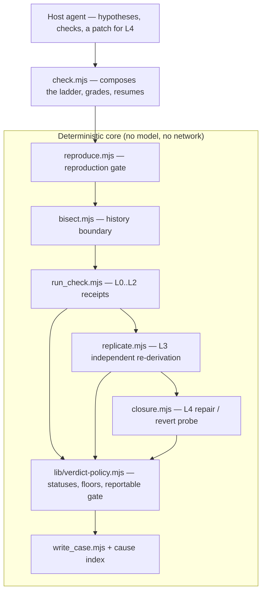

# Ducktective — Implementation Plan & Strategy

Written **2026-09-19** against `a7b4755`. This is the plan document: what we learned
from four sibling projects we do not control, what Ducktective should take and reject,
the refined logic that comes out of it, and the order to build it in.

Companions: [ducktective-design.md](ducktective-design.md) (v3 — the blind checker and
the E5 consistency check; v2 — why the project redirected), [architecture.md](architecture.md)
(what exists today), [ref-work.md](ref-work.md) (the first landscape review),
[critique-2026-09-15.md](critique-2026-09-15.md) (the objection), and
[guide.md](guide.md) (a worked walkthrough).

The sources dissected below are gitignored clones under `ref/` and are **never
imported**. Clones: `ref/anypoc`, `ref/BugTraceAI-CLI`, `ref/abrt`, `ref/AI-dev-assistant`.

> **Status of this document.** Everything here is a proposal. Nothing in it is
> implemented until a test says so. The single mechanical rule that governs the order
> is AGENTS.md #6: real measurement outranks product work, so the benchmark comes
> before the new surface.

---

## 0. The strategy in one paragraph

Ducktective today is a falsification gate: a claim is `confirmed` when a check agreed
with its prediction and a control passed or a probe flipped. That is necessary and not
sufficient — it establishes that the check is _sensitive to a line_, never that the
cause is _true_. The refined strategy is to stop selling a verdict and start
manufacturing a **receipt ladder**: a claim is promoted only through a sequence of
independent, mechanical discriminations — prediction, control, line-neuter, independent
re-derivation, and finally a **reversible repair probe** (fix it and the repro passes;
re-break it and the repro fails) — each recorded with a numeric cause-confidence. The
resulting case is deduplicated by _cause identity_, quality-rated, and **gated:
not-reportable until the ladder clears**. A confidently wrong cause stops being merely
unproven and becomes mechanically unfilable. The two ideas no sibling project has are
the two-sided repair probe and cause-identity dedup across investigations; everything
else is borrowed discipline from systems that have survived contact with real users.

---

## 1. The four references, dissected

### 1.1 AnyPoC — `ref/anypoc` (arXiv 2604.11950)

**What it is.** An agentic bug hunter and proof-of-concept generator for large C/C++
targets (Firefox, OpenSSL, FFmpeg). It reports 130+ bugs found, with a public buglist.

**What it actually does, mechanically:**

- **Scanner strategies** (`src/scanner/strategies/`): `history` (mine bug-fix commits,
  then hunt _unfixed siblings_ of the same root cause), `focused` (scope an LLM session
  to an area), `commit-pr` (review one change). Strategies are registered classes that
  declare `params` and stream `BugReport`s from an async generator
  (`src/scanner/types.py`).
- **Content-addressed jobs** (`src/scanner/runner.py`): `scan_id = sha1(strategy,
inputs)` and a `manifest.json`; re-running the same inputs **resumes** the existing
  job. Then a bounded PoC worker pool runs concurrently with the scanner, coordinated
  by a `BackpressureGate` (`src/scanner/backpressure.py`).
- **Four-stage PoC pipeline** (`src/anypoc/core/generator.py`): analyze (is the report
  real?) → generate (iterate a PoC until it triggers) → **evidence check** → report.
- **The evidence checker is the important part** (`src/anypoc/core/evidence_checker.py`):
  a _separate agent session_ whose instructions say, in effect, "read the evidence only
  to know what to expect; **the only thing that matters is whether reproduction
  succeeds**; trust your own run over the provided evidence." Its terminal vocabulary is
  `PASSED / FLAKY / NOT_REPRODUCIBLE / INVALID_EVIDENCE / IMPOSSIBLE`.
- **Attempts and escalation** (`src/anypoc/core/status.py`): every run is
  `attempt_N/status.json`; an agent can stop with `help_needed` plus a concrete reason;
  `manager retry --from-attempt N -c "guidance"` creates a new attempt that inherits the
  previous one's context. `get_final_status()` is a pure priority function.
- **Measured memory** (`src/anypoc/core/knowledge/manager.py`): knowledge is extracted
  from trajectories, indexed by keywords, **rated −10..10 by the agent after use**, then
  **archived** below an average threshold once it has at least a minimum number of
  ratings. Content and metadata are split so agents can read freely while the system
  owns the numbers.
- **Governance**: a dollar `SpendLimiter` checked before each task, a per-project Docker
  image for crash isolation, prompt/trajectory files kept per run for audit.

**Lesson for us.** Reproduction is the source of truth, and it is checked by a session
that did not write the artifact. Memory is allowed to exist only after it earns ratings
from use. Long runs resume by identity. Cost is bounded before work starts.

### 1.2 BugTraceAI-CLI — `ref/BugTraceAI-CLI` (v4.0.0, Apache-2.0)

**What it is.** An agentic offensive-security scanner. Its own tagline is the
Ducktective thesis with different nouns: _"Think like a pentester, execute like a
machine, validate like an auditor"_ and _"AI hypothesizes, tools validate."_

**What it actually does, mechanically:**

- **Six-phase reactor**: recon → discovery (6 LLM personas, consensus vote, plus a
  dedicated **Skeptical** persona) → strategy/routing → exploitation (15 specialist
  agents driving SQLMap, Playwright, CDP) → validation (browser + vision) → reporting.
- **Pure policy module** (`bugtrace/core/finding_policy.py`) with no I/O: canonical
  status strings, `TERMINAL_VERDICTS`, `REPORTABLE_STATUSES`, a `CONFIDENCE_FLOOR` map,
  severity ranking, a `finding_identity_key()` for dedup, and
  `statuses_aligned_with()` — a **parity check** that the persistence enum and the
  policy agree.
- **Finding lifecycle** (`schemas/db_models.py`): `PENDING_VALIDATION →
VALIDATED_CONFIRMED | VALIDATED_FALSE_POSITIVE | MANUAL_REVIEW_RECOMMENDED |
SKIPPED | ERROR`. Only confirmed and manual-review are reportable.
- **The probing status**: the README's flow is `CANDIDATE → PENDING_VALIDATION →
CONFIRMED / FALSE_POSITIVE → PROBE_VALIDATED`, i.e. a distinct "a real tool proved
  it" state beyond "we believe it".
- **Resume and audit**: `--resume`, `last_phase_completed`, `retry_count`,
  `llm_audit.jsonl`, provenance telemetry (`poc_enrichment_provenance`,
  `reporting_failover_count`), and "confirmed findings are never silently dropped".
- **Model Lab**: they benchmark their own model choices with composite scores and
  per-slot leaderboards.

**Lesson for us.** Put transition rules in a pure module, keep the persistence enum as
an adapter, and **assert they are aligned**. Have an explicit `PROBE_VALIDATED`-class
state. Only a small, named set of statuses is reportable. Dedup by a stable identity
tuple, not by prose.

### 1.3 ABRT — `ref/abrt` (v2.17.9)

**What it is.** The Fedora/RHEL Automatic Bug Reporting Tool: a decade-hardened
crash-reporting system. (The clone has a populated `.git` but an empty working tree; the
sources below are read from git objects at `HEAD`.)

**What it actually does, mechanically:**

- **The problem directory is the product.** A crash is a real directory under
  `/var/spool/abrt/` with **one file per element** (`FILENAME_*` constants in
  libreport). Standard elements: `type`, `analyzer`, `executable`, `cmdline`, `reason`,
  `backtrace`, `coredump`, `package`/`component`/version, `uuid`, `duphash`,
  `crash_function`, `rating`, `count`, `not-reportable`, `reported_to`, `event_log`.
- **A quality rating gates reporting.** `abrt-action-analyze-backtrace` writes a
  **backtrace `rating`** and the `crash_function`; the documented purpose of the rating
  is "to prevent reporting of bugs with low quality (non-informative) backtraces."
  `abrt-action-analyze-vulnerability` writes a second, severity-like **exploitable
  rating (0–9)**.
- **`not-reportable`** is a file whose presence blocks reporting outright.
- **An event pipeline** in `/etc/libreport/events.d/`: `post-create`, `notify`,
  `analyze_*`, `report_*`, `workflow_*` rule the processing, so the lifecycle is data,
  not code.
- **Dedup and recurrence**: `duphash` groups crashes; `count` records occurrences;
  `reported_to` tracks every destination an issue went to.
- **Analytics**: FAF aggregates crashes across a fleet; Retrace Server symbolises
  backtraces centrally.

**Lesson for us.** An evidence artifact is a durable structured directory, not a row.
Evidence quality is a **number computed by a tool**, and that number **blocks
reporting** rather than merely annotating it. Dedup and recurrence are first-class
(`duphash` + `count`), because the second occurrence of a known root cause is the
cheapest signal there is.

### 1.4 AI-dev-assistant (QyverixAI) — `ref/AI-dev-assistant`

**What it is.** A code-analysis workspace: paste code or a zip, get an explanation, a
bug scan (65+ rules across 9 languages, plus Python AST), and improvement suggestions
with a **0–100 score and A–F grade**.

**What it actually does, mechanically:**

- **A deterministic engine is the floor, the LLM is optional enrichment**: it works
  fully offline with no key; when the provider is down it degrades gracefully back to
  rules (`docs/ARCHITECTURE.md`).
- **A score and a grade are the deliverable**, with prioritised suggestions and
  before/after diffs.
- **Freshness and reproducibility**: SSE streaming, response caching, a GitHub Action
  that comments on PRs, per-IP rate limiting, `/healthz/live` vs `/healthz/ready`, and
  Prometheus `/metrics`.
- **CI discipline**: seven workflows, a schema-tests job, Gitleaks secret scanning, and
  explicit edge-case documentation for every endpoint.
- Their own README admits the architecture doc "predates several features" — the same
  reference-rot failure this repo guards against.

**Lesson for us.** The deterministic core must be complete and useful on its own; the
model adds hypotheses, not truth. A score + grade is a shippable artifact. Observability
and CI are part of the product, not overhead.

### 1.5 Cross-cutting comparison

| Dimension              | AnyPoC                                | BugTraceAI                              | ABRT                                      | AI-dev-assistant       | Ducktective today                 |
| ---------------------- | ------------------------------------- | --------------------------------------- | ----------------------------------------- | ---------------------- | --------------------------------- |
| Core claim             | reproducible PoC                      | validated vulnerability                 | reported crash                            | explained/checked code | verified root cause               |
| Independent validation | separate evidence-checker agent       | dedicated validator + skeptical persona | retrace, rating, reporters                | none (optional LLM)    | `--verify` (same oracle)          |
| Evidence artifact      | attempt dir + md report               | DB row + JSON/MD/HTML                   | **problem directory**                     | JSON response          | JSONL + md mirror                 |
| Quality rating         | status enums                          | confidence floor                        | **backtrace rating 0–4, exploitable 0–9** | 0–100 + A–F            | check letter grade                |
| Reporting gate         | status must pass                      | reportable statuses                     | **`not-reportable` file**                 | none                   | confirmed needs receipt           |
| Dedup / recurrence     | knowledge keywords                    | `finding_identity_key`                  | **`duphash` + `count`**                   | cache key              | case `id` only                    |
| Resume / retry         | `scan_id`, `attempt_N`, `help_needed` | `--resume`, `last_phase_completed`      | event pipeline re-run                     | cache                  | none                              |
| Sandbox                | Docker per project                    | Docker                                  | system hooks                              | n/a                    | **none (documented)**             |
| Cost / concurrency     | `SpendLimiter`, backpressure          | per-phase concurrency                   | n/a                                       | rate limit             | `bisect --budget`                 |
| Memory                 | rated + archived knowledge            | DB                                      | FAF analytics                             | history/favorites      | retired                           |
| Model-free core        | no (agents required)                  | no                                      | **yes**                                   | **yes**                | **yes (tools are deterministic)** |
| Measures itself        | buglist / paper                       | Model Lab                               | fleet analytics                           | Prometheus + codecov   | 213 tests + mutation canary       |

---

## 2. What we take, what we reject

### Take

1. **Independent replication as the truth test** (AnyPoC). `--verify` re-runs the same
   oracle in a new process; that catches a flaky oracle and nothing else. Promotion to
   the top of the ladder must require a _second, independently written_ check.
2. **Pure policy module + parity guard** (BugTraceAI). The verdict rule lives in two
   places today (`classify()` in `run_check.mjs`, `policyViolations()` in
   `lib/case-file.mjs`). Extract one pure module and assert enum/policy alignment.
3. **Reportable-statuses and confidence floors** (BugTraceAI + ABRT). A cause is not
   merely unconfirmed; it is _not reportable_ until the ladder clears. Make that a
   derived predicate, not prose.
4. **A computed evidence rating that blocks reporting** (ABRT). Ducktective already
   computes a grade in `check.mjs`; make the case itself carry a numeric
   `cause_confidence` produced by the ladder, and let it gate `confirmed`/`reported`.
5. **Cause identity + recurrence** (ABRT `duphash`/`count`, BugTraceAI
   `finding_identity_key`). Hash the cause (accused location + normalised hypothesis +
   failing signature + frame set). Dedup repeat investigations and count how often a
   function breaks — the cheapest preventative signal available.
6. **Attempts, retry, and human escalation** (AnyPoC `attempt_N`/`help_needed`,
   BugTraceAI `MANUAL_REVIEW_RECOMMENDED`). `exhausted` is currently a dead end; a
   first-class "I need a human" terminal state is part of honest reporting.
7. **Content-addressed resumable jobs** (AnyPoC). The benchmark and long investigations
   must resume by identity, not from scratch.
8. **Deterministic core, optional model enrichment** (AI-dev-assistant). Keep every tool
   runnable with no API key; the host agent is the only model.
9. **Audit and provenance everywhere** (all four). Ducktective is already strong; keep
   extending `RUNLOG` provenance and add an event log per case.
10. **Ship measured outcomes** (AnyPoC buglist, BugTraceAI Model Lab, ABRT FAF). This is
    the cultural lesson and the reason the benchmark is Phase 1, not a later nicety.

### Reject (for now, with reasons)

1. **Multi-persona debate and consensus voting** (BugTraceAI's 5+1 personas).
   Ducktective's SKILL.md already rules out multi-agent debate, and the cost of an
   ensemble is unmeasured. We take only the _single, focused adversary_ shape: one
   independent re-derivation, not a committee.
2. **Docker-first sandboxing as the default product path.** AnyPoC and BugTraceAI must
   isolate hostile binaries; Ducktective's user runs their own test suite in their own
   repo and approves each command. We containerise only the **benchmark arms**.
3. **A server, dashboard, database, or MCP daemon.** AnyPoC and BugTraceAI are large
   systems with web UIs; AI-dev-assistant has FastAPI/Postgres/WebSocket. Ducktective's
   entire distribution advantage is a copy-one-folder skill with zero dependencies.
   Keep it.
4. **LLM code explanation / quality scoring of the user's style.** That is
   AI-dev-assistant's product, not ours.
5. **SBFL/Ochiai spectrum ranking and delta-debugging, now.** Design §E3/E4 park both
   behind the benchmark. Nothing in the four refs changes that.
6. **Model Lab-style model benchmarking.** Interesting, but it is a different product;
   our benchmark measures _the loop_, not model choice.

---

## 3. The refined logic

### 3.1 Why the current model is not enough

`classify()` confirms when:

```
held = (predicted == "pass") == (exit == 0)
confirmed  ⟺  held ∧ (passing control ∨ flipped probe)
```

The probe removes the always-pass hole (D2 in design v2). But a flip only shows the
check's outcome _changed when the line changed_. It does not show the line is the
cause: a check can be sensitive to a line that is upstream of the real fault, and an
enabling change can make an old defect visible. The current model has **sensitivity but
no sufficiency and no necessity**.

### 3.2 The receipt ladder

Introduce a monotone ladder. Each rung is a mechanical discrimination, recorded
separately, and the case's `cause_confidence` is a function of the rungs cleared.

| Rung   | Name           | Question it answers                                                    | Mechanism                                                                                       | Status today        |
| ------ | -------------- | ---------------------------------------------------------------------- | ----------------------------------------------------------------------------------------------- | ------------------- |
| **L0** | Prediction     | Does the check agree with the claim?                                   | `--predict` vs exit code                                                                        | shipped             |
| **L1** | Control        | Is it not always-fail?                                                 | `--control` on a known-good path                                                                | shipped             |
| **L2** | Mutation       | Is it sensitive to the accused line?                                   | `--probe` neuter on a scratch worktree                                                          | shipped             |
| **L3** | Replication    | Does an independently written check reach the same verdict?            | `blind_check` receipt + `unreplicated` verdict; `--replicate N` for flakiness is still to build | **receipt shipped** |
| **L4** | Causal closure | Does repairing the cause fix the repro, and re-breaking it fail again? | new `--repair-probe` / `--revert-probe` on a scratch worktree                                   | **proposed**        |

**L3 — replication, and it must be blind.** Design v3 makes the context rule
non-negotiable: the checker receives **only** the case file's structured fields —
`symptom`, `reproduction`, `candidates[rank].location`, `candidates[rank].check` — and
nothing else: no chat history, no chain-of-thought that produced the hypothesis. It
re-derives from cold. Same-process reconciliation ("the same run saw the probe flip") is
what the reward-hacking literature says is not enough, because the model that wrote the
check is still in context when it grades the check. A blind disagreement downgrades the
claim; the fraction it downgrades is metric C8, and if C8 is near zero the blind step
should be cut back to the cheaper same-process version. Repeat `--replicate N` to surface
flakiness (AnyPoC's `FLAKY`).

**Shipped 2026-09-20:** the tool side exists — candidates carry a `blind_check` receipt,
a non-confirming verdict is stored as `unreplicated` rather than `confirmed`, and
`write_case.mjs --require-blind` refuses a confirmation with no receipt. The host agent
runs the fresh context; the tool enforces the receipt, because a skill must not embed a
model runtime. C8 is measured by the benchmark, not by the canary.

**L4 — causal closure (the new mechanism).** This is the rung nobody in the four refs
has, and it composes Ducktective's own two best tools:

- `--revert-probe`: when `bisect.mjs` found a first-bad commit, check out a scratch
  worktree, revert exactly the blamed hunk, and re-run the failing command. If the repro
  turns green, the cause is _sufficient_ to explain the symptom; re-apply the hunk and
  the repro must turn red again (necessity). This needs no model and uses `bisect`'s
  output.
- `--repair-probe`: when there is no blamed commit (or bisect was skipped), take a
  model-authored one-line patch, apply it on a scratch worktree, run the failing
  command — it must pass — then revert only that line and run again — it must fail. The
  regression is never written to the user's tree.

Both produce a two-sided result. A one-sided flip (`--probe`) is a sensitivity receipt;
a two-sided closure is a causal receipt. The ladder makes the difference visible rather
than collapsing it into one word.

**Honest limits, recorded not hidden.** A non-closure does not prove a non-cause: a
multi-cause bug, a patch that is not minimal, or an enabling-commit history will all
fail L4 for a real cause. So L4 is _conjunctive evidence_, never a refutation — the
same epistemic shape as the probe's non-flip. This is stated in the tool, in the case
file, and in architecture.md when it ships.

### 3.3 Claim lifecycle, confidence floor, reportable gate

Adopt the BugTraceAI/ABRT shape. A new pure module `scripts/lib/verdict-policy.mjs`
(no I/O) owns:

```text
STATUSES = {
  open, reproduced, does_not_reproduce, exhausted,
  pending_validation, confirmed, unreplicated, flaky,
  false_positive, manual_review, blocked, reported
}
TERMINAL = { confirmed, false_positive, manual_review, blocked }
REPORTABLE = { confirmed, manual_review }
CAUSE_CONFIDENCE_FLOOR = { confirmed: 0.8, manual_review: 0.5, default: 0 }
```

- `cause_confidence` is **derived from the ladder**, never typed by the model:
  e.g. `L0=0.2, L1=0.35, L2=0.5, L3=0.7, L4=0.9`, capped by any failed rung.
- `reportable = status ∈ REPORTABLE ∧ confidence ≥ floor ∧ no failed receipt`.
- `not-reportable` is written when the gate fails; `confirmed_cause`, a patch, or
  `high` confidence require `reportable`.
- `classify()` and `policyViolations()` both call this module; a **parity test** asserts
  the schema enum, the module's status set, and the writer's rules agree — the
  BugTraceAI `statuses_aligned_with()` idea as a test in this repo.

**Shipped in 0.2.0:** `scripts/lib/verdict-policy.mjs` exists and both callers use it;
`cause_confidence` is derived from the recorded receipts and a `reportable` gate is
enforced; `verdict-policy.test.mjs` is the parity test. **Not yet shipped:** the
extended status vocabulary above (`unreplicated`, `flaky`, `manual_review`, `blocked`,
`reported`) and the 0.8 floor — today's floor is 0.5, the weakest receipt the current
contract accepts, and it rises only when L3/L4 exist. The module is the seam those
extensions plug into.

### 3.4 Cause identity and recurrence

Add to the case file:

- `cause_hash` — a content hash of `(repo-relative location, normalised hypothesis,
failing-command signature, top-K frame files/functions)`. Two investigations of the
  same fault hash the same.
- `cause_key` — the human-readable identity tuple, kept next to the hash for audit
  (BugTraceAI's `finding_identity_key`).
- `count` — how many distinct cases in this repo share the cause.
- `not_reportable` — the gate's reason, if any.

`write_case.mjs` is dedup-aware: a new case whose `cause_hash` matches an existing one
increments `count` and links, instead of adding a near-duplicate row. The store stays
append-mostly; the _hash index_ is what is new. `write_case.mjs --causes` prints the
most-recurrent causes in a repo — the preventative signal ABRT gets from `count`.
**Shipped in 0.2.0.**

### 3.5 The case as a durable directory

Adopt ABRT's shape incrementally, not in one rewrite:

```
.ducktective/
  cases.jsonl                       # the index, one line per case id (shipped)
  causes.jsonl                      # cause_hash → case ids, count   (shipped in 0.2.0)
  cases/<id>/
    symptom.md
    reproduction.json
    candidates/<n>/receipts.json    # one file per rung, immutable once written
    rating                          # derived cause_confidence + reportable
    event_log                       # every command the tools executed
  cases/<id>.md                     # the human mirror (shipped)
```

The JSONL and the mirror stay; the directory adds the immutable, per-rung evidence and
the audit trail that the four refs all keep and Ducktective currently folds into a
single `evidence` string.

### 3.6 Attempts, retry, escalation

- A case can hold `attempts: [...]`; each attempt records its ladder rungs and status.
- `run_check.mjs --retry-from N --note "guidance"` starts a new attempt that inherits
  the prior attempt's blockers (AnyPoC's `help_needed` + `retry`).
- `manual_review` and `blocked` are terminal, reportable statuses for the cases a tool
  cannot settle: a dependency-only fault, a hardware/env constraint, an ambiguous
  multi-cause. They are honest outcomes, not failures (BugTraceAI's
  `MANUAL_REVIEW_RECOMMENDED`, AnyPoC's `IMPOSSIBLE`).
- `check.mjs --resume` continues from the last completed stage (BugTraceAI's
  `last_phase_completed`).

### 3.7 Deterministic core, model enrichment

Every tool stays runnable with no API key. The host agent supplies hypotheses and
checks; the tools decide. This is already true; the plan makes it an explicit
non-negotiable and keeps the benchmark's _bare_ arm as a real, deterministic baseline
(AI-dev-assistant's offline mode as the model for "the core must stand alone").

### 3.8 What stays out

Graph databases, embeddings, multi-agent debate, a server, a dashboard, SBFL and ddmin
before the benchmark, and automatic patching. SKILL.md's "Out of scope" section gets a
pointer to this document rather than an expansion.

### 3.9 E5 — why/evidence consistency (shipped)

Design v3 §1: `why` is free-text, model-authored, procedural, and the field the
hallucination literature flags hardest. `whyViolations()` now flags a `why` or
`hypothesis` that cites a `file:line` appearing nowhere in the case's own candidate
locations, stack, or covered sites (basename match, so path differences do not matter).
It **records, it does not refuse**, so the violation rate (C9) is measured before it
gates anything. A `why` that names no location makes no checkable claim and passes.

### 3.10 Tier 1 — the mutation canary (shipped, design v3 §2)

Design v3's cheapest continuous signal, and a better near-term deliverable than the
benchmark harness: a mutant a test catches is a root cause **by construction**. The canary
(`evals/canary.mjs`, `npm run canary`) mutates a target module, keeps the mutants the
target's own test command kills, feeds the failing command to `reproduce.mjs`, and scores
whether the spine's first lead is the line it just broke. It also seeds **survivors** —
the equivalent-mutant check: a green suite must return `does_not_reproduce` with zero
candidates, not a hallucinated lead.

It reports two kinds separately on purpose. A mutant that throws leaves its own line in
the traceback, so `cause_hit` is meaningful; a mutant that silently returns a wrong value
fails the assertion at the _test_ line, so the traceback cannot name the mutated line.
That gap is the coverage prior's whole job, and averaging the two into one number would
hide it.

**First measured run** (2026-09-19, `evals/canary/target/calc.mjs`, 11 mutants): 8 killed,
cause-hit@1 **88% [7/8]**; `throw-return` mutants 100% [7/7], `gt` mutants 0% [1/1] — the
honest shape above. Survivors: **100% [3/3]** produced no candidate.

**Second target — this repo's own `bench/report.mjs`** (7 mutants, `node --test
bench/smoke.test.mjs`): 4 killed, cause-hit@1 **25% [1/4]**; the one throwing mutant hit
100%, every value mutant 0%. That is the same gap at repo scale, and it is a finding: on
JS `reproduce.mjs` seeds from traceback frames only (coverage ingestion is Python-only),
so a silent wrong-value fault names the _test_ line, not the mutated line. JS coverage
ingestion is now the obvious candidate for ranking work — after the benchmark.

Its limit, stated in the tool: mutants are an easier, differently-shaped target than real
faults, so the canary is a **regression alarm** and a gross-breakage detector — never
evidence the product works on real bugs. That claim requires Tier 2 (the benchmark), and
only Tier 2.

---

## 4. Target architecture



**Shipped:** `scripts/lib/verdict-policy.mjs`, plus the confidence/reportable/cause
fields on `case-file.mjs`. **Proposed:** `scripts/replicate.mjs` (L3) and
`scripts/closure.mjs` (L4), and the `check.mjs` flags `--replicate`, `--repair-probe`,
`--resume`.

---

## 5. Measurement

The benchmark from design §4 is unchanged and still first. The ladder adds metrics:

| id  | metric                                                  | definition                                                                                       |
| --- | ------------------------------------------------------- | ------------------------------------------------------------------------------------------------ |
| C1  | cause-hit@1 (hunk)                                      | claimed span intersects a gold bug-fix hunk                                                      |
| C2  | **false-confirm rate**                                  | emitted a reportable cause that misses every gold hunk — **the product**                         |
| C3  | abstention rate                                         | stopped / manual_review instead of asserting                                                     |
| C4  | token cost                                              | per instance, per arm                                                                            |
| C5  | wall clock                                              | harness-measured                                                                                 |
| C6  | bisect yield                                            | fraction where bisect returned a commit; of those, fraction containing a gold hunk               |
| C7  | probe kill rate                                         | otherwise-confirmed verdicts demoted by L2 (vacuous)                                             |
| C8  | **blind-checker overturn rate** (design v3)             | of would-be-confirmed verdicts, the fraction the stripped-context re-derivation downgrades       |
| C9  | **why/evidence consistency violation rate** (design v3) | fraction of cases whose `why`/`hypothesis` cites a location absent from their own evidence       |
| C10 | replication survival (L3)                               | confirmed claims that survive an independently written check                                     |
| C11 | closure yield / false-positive (L4)                     | confirmed claims where the reversible repair probe closes; of those, how many miss the gold hunk |
| C12 | cause recurrence                                        | distinct causes vs rows, computed from `cause_hash`                                              |

C2 is still the headline. **C8 is design v3's strongest single number** — it is the
measured size of the reward-hacking problem this project exists to solve; if it is near
zero, the blind checker bought nothing and should be cut back. C11 is the evidence that
the two-sided probe earns its cost, and it too is allowed to return zero and kill the
mechanism. C9 is the only one of these that can be measured **today**, because E5 records
rather than refuses.

---

## 6. Phased plan

### Phase 0 — Measurement integrity and the policy foundation (NOW)

Small, mechanical, no new product surface. Fixes a verdict-corruption risk and lays the
module the refined logic is built on.

| #    | Ticket                                                                                                                                                    | Files                                                                  | Acceptance                                                                                                  |
| ---- | --------------------------------------------------------------------------------------------------------------------------------------------------------- | ---------------------------------------------------------------------- | ----------------------------------------------------------------------------------------------------------- |
| P0-1 | Extract `verdict-policy.mjs`: statuses, terminal/reportable sets, confidence floors, transition rules; call it from `classify()` and `policyViolations()` | `scripts/lib/verdict-policy.mjs`, `run_check.mjs`, `lib/case-file.mjs` | Parity test asserts schema enum = policy statuses = writer rules; all existing verdict tests pass unchanged |
| P0-2 | Add `cause_confidence` (derived) + `reportable` + `not_reportable`; gate `confirmed_cause`/patch/`high` on reportable                                     | schema, `case-file.mjs`, `write_case.mjs`                              | A confirmed case below the floor is refused; a closed case is reportable                                    |
| P0-3 | Persist probe `attempts` + artifact outcomes; expose the artifact rate                                                                                    | `run_check.mjs`, schema, `renderMarkdown`                              | Fixture where delete is an artifact and neutralize flips records both; C7 computable from the store         |
| P0-4 | Add `cause_hash`, `cause_key`, `count`; dedup on write; `--causes` helper                                                                                 | schema, `case-file.mjs`, `write_case.mjs`                              | Two cases with the same hash increment `count` and link; distinct causes do not collapse                    |
| P0-5 | Fix the stale `query_memory.mjs` hint in `bin/install.mjs`; add a guard against retired tool names in shipped files                                       | `bin/install.mjs`, `scripts/*.test.mjs`                                | Guard fails on a planted retired name                                                                       |
| P0-6 | Scaffold `bench/`: declared-source registry with strict validation, content-addressed job id, instance-spec validation, and the C1–C12 arithmetic         | `bench/sources.mjs`, `bench/report.mjs`                                | Unknown source/params refused; job id stable across key order; arithmetic matches hand-computed gold values |
| P0-7 | Record the next real investigation with `--provenance real`                                                                                               | `evals/RUNLOG.jsonl`                                                   | Report prints at least one real row                                                                         |

### Phase 1 — The benchmark result

| #      | Ticket                                                                                                                                      | Acceptance                                                  |
| ------ | ------------------------------------------------------------------------------------------------------------------------------------------- | ----------------------------------------------------------- |
| P1-0 ✅ | `bench/materialize.mjs`: clone a repo at its commit into a throwaway dir, verify the gold hunks name real lines and the repro actually fails | throwaway-git-repo tests; a passing repro is refused        |
| P1-0b ✅ | Oracle for silent bugs (`oracle` + `fixCommit`, verified fail-at-bug/pass-at-fix), the `testPatch` FAIL_TO_PASS shape, `mode: "worktree"` for repos that need their own toolchain, and `bench/mine.mjs` to propose candidates | the materialiser refuses an oracle that passes at the bug or fails at the fix; a real silent-bug instance and eleven test-patch instances verify (`corpus/`, 12 total, all from the designer repo); `corpus/README.md` states the leakage caveat |
| P1-1 ✅ | Arm runner shelling out to a host agent CLI (no embedded runtime); arm A bare, arm B skill; same model/budget; tokens + wall clock captured  | one instance runs both arms and emits a JSONL row; a harness registry auto-detects the CLI (`--agent`), OpenCode v2 verified, stub for CI; a real run still needs a corpus + model |
| P1-2 ✅ | Metrics computer C1–C12 in `bench/report.mjs`                                                                                               | matches hand-computed gold values on the smoke set          |
| P1-3   | First run ≥30 instances, held-out third untouched; budget + bounded concurrency                                                              | dated JSONL + table; decision written before interpretation |

### Phase 2 — Gate and decide

Apply design §4's rule on C2 (a ≥10 pt drop at ≤2× tokens keeps the protocol; under 5 pt
or over 3× archives it and keeps `bisect`+`probe` as the standalone `check`; C7≈0 deletes
the probe). Record the outcome in the README **before** the ladder work is allowed to
continue.

### Phase 3 — The ladder (only if Phase 2 says the loop pays)

| #    | Ticket                                                                                          | Depends on |
| ---- | ----------------------------------------------------------------------------------------------- | ---------- |
| P3-1 | `replicate.mjs` (L3) + `flaky`/`unreplicated` statuses + `--replicate N`                        | Phase 2    |
| P3-2 | `closure.mjs` with `--revert-probe` (bisect-driven, model-free) then `--repair-probe`           | Phase 2    |
| P3-3 | `cause_confidence` wired from the ladder; reportable gate enforced; C8–C12 measured on a re-run | 3.1, 3.2   |
| P3-4 | Attempts/retry/`manual_review`/`blocked` and `check.mjs --resume`                               | 3.1        |

### Phase 4 — Conditional product work

- `spectrum.mjs` (Ochiai) only if C1 is materially below the field's ~81% recall@1.
- `shrink.mjs` (ddmin) only if the repro carries an input surface.
- Memory only if C10/retrieval changes a decision; then adopt AnyPoC's
  rate-after-use + version + archive-with-sample-floor, never nearest-case ranking.
- The ABRT-style case directory when the per-rung evidence outgrows the JSON string.

---

## 7. What to implement right now

> **Status 2026-09-20 (v0.2.0).** P0-1 through P0-5 are **done and tested**, and so are
> design v3's **E5** why/evidence consistency check, the **blind-checker receipt (E2)** —
> `blind_check`, the `unreplicated` verdict, `--require-blind` — and the **Tier-1
> mutation canary** (`npm test` 213/213; `npm run canary`: 88% cause-hit@1 on the
> fixture, 25% on this repo's own `bench/report.mjs`, 100% no-candidate on survivors).
> The benchmark now ships as an instrument: the **`ducktective-bench` skill**
> (`skills/ducktective-bench/SKILL.md`), the **materialiser**, the **arm runner** with a
> **harness registry** that auto-detects OpenCode, and the C1–C12 arithmetic. The corpus
> is seeded with **twelve verified real instances** from the designer repo (one
> host-authored oracle for a silent bug, eleven test patches mined by `bench/mine.mjs`),
> verified fail-at-bug/pass-at-fix but not vetted for leakage. **Not built:** a real-model
> run, the Docker/remote corpus sources, the causal-closure probe (L4), and the Tier-2
> result. The next real work is more instances (the target is ≥30) plus `DT_MODEL`, then
> the first ≥30-instance run.

The order remains:

1. **P0-1** — `verdict-policy.mjs` + the parity test. This is the highest-value small
   change: it removes the two-places defect, adopts the proven BugTraceAI shape, and is
   the foundation every later status change needs.
2. **P0-2** — derived `cause_confidence`, `reportable`, and the `not-reportable`
   gate. This is the ABRT lesson and it immediately strengthens `write_case.mjs`.
3. **P0-3** — persist probe attempts and artifact rate, so C7 is computable.
4. **P0-4** — `cause_hash`/`count` and the cause index. Unique among the
   four refs in this combination and cheap once the policy module exists.
5. **P0-5** — the installer drift and its guard.
6. **P0-6** — start `bench/` with the source registry and the C1–C12 arithmetic. The
   decisive work; start it in the same stretch because everything after Phase 0 waits on
   it.

Stop there until the benchmark produces a C2 number. The temptation will be to build
L3/L4 because they are the interesting part; that is exactly the displacement activity
design v2 and the 2026-09-15 critique were written about.

---

## 8. Risks, falsifiers, and what would make this wrong

1. **C2 does not move** → the protocol does not pay; archive it and keep the standalone
   `check`. The ladder does not rescue a loop whose baseline is already good.
2. **C7 ≈ 0** → models already write discriminating checks; delete the probe.
3. **C8 (blind-checker overturn rate) ≈ 0** → the reward-hacking problem this document
   treats as central is not your problem in practice; cut the blind checker back to the
   cheaper same-process probe and spend the budget on E1/E3.
4. **C10 (replication survival) ≈ 1** → the first check was already trustworthy; L3 is
   ceremony. Keep it as a status only.
5. **C11 closure false-positive rate is high, or closure yield is near zero** → the
   two-sided probe is measuring patch quality or enabling-commit history, not cause.
   Drop L4 and revert to the one-sided probe.
6. **The corpus is too contaminated** (arm A suspiciously strong on SWE-bench, weak on
   the fresh slice) → the benchmark plan is compromised; fall back to the field study
   with the mechanical receipts making human grading cheaper.
7. **The ladder makes investigations too expensive** (tokens/wall clock blow past 3×) →
   make rungs opt-in per case and re-measure; do not ship ceremony.

Every one of these is pre-registered here so the decision is made against a stated
falsifier rather than a feeling after the fact.

---

## 9. Open decisions

1. **Corpus**: BugsInPy (existing Docker harness, reproducibility decay) + a small
   fresh mined slice, or a cheaper hand-picked real-repo pilot to shake out the harness
   first?
2. **Arm runner**: which host CLI (`claude`/`codex`), and confirm shelling out is the
   accepted way to stay a skill rather than a runtime.
3. **L4 shape**: `--revert-probe` first (model-free, bisect-driven) before
   `--repair-probe`, or both together?
4. **Canary targets**: this repo's own suite first (design v3 says so), then which of
   `floorplanner`/`vitruva` — and which mutator for JS/TS.
5. **Resolved:** the cause index is a separate flat `.ducktective/causes.jsonl`
   (shipped in 0.2.0), not extra fields on `cases.jsonl`.

---

## 10. Source index

- `ref/anypoc` — README; `src/scanner/{types,runner,backpressure}.py`;
  `src/anypoc/core/{generator,manager,evidence_checker,status,hunt}.py`;
  `src/anypoc/core/knowledge/manager.py`; `src/skills/anypoc/SKILL.md`.
- `ref/BugTraceAI-CLI` — README; `bugtrace/core/finding_policy.py`;
  `bugtrace/schemas/db_models.py`.
- `ref/abrt` — README; `CLAUDE.md`; `doc/abrt-action-analyze-backtrace.txt`;
  `doc/abrt-action-analyze-vulnerability.txt`; `doc/abrt-action-analyze-python.txt`.
- `ref/AI-dev-assistant` — README; `docs/ARCHITECTURE.md`.
- Ducktective: `docs/ducktective-design.md` §3–§5; `docs/architecture.md` §12;
  `skills/ducktective/SKILL.md`; `skills/ducktective/scripts/lib/case-file.mjs`.
